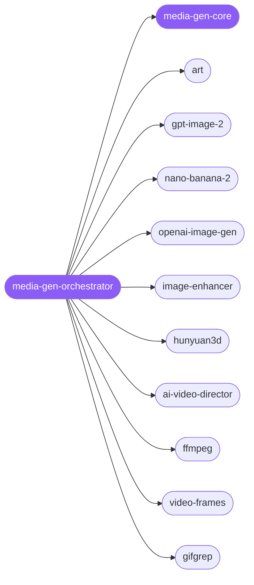

<div align="center">

</div>

<div align="center">

[](../../profiles.json)
[](#skills)
[](../../NOTICE)
[](https://skills.sh/)

</div>

> The single entry skill for generative and transformational media work. It locates a task on the **modality × stage** map — *what asset* (image / 3D / video / GIF) and *what stage* (generate → transform → assemble) — and routes to one of its specialist spokes, while `media-gen-core` owns the cross-cutting decision every request shares: which backend to use given its access/billing model and modality.

## Hub-and-spoke



_…and 3 more in the table below._

## Skills

| Skill | Role | Loaded at startup |
|---|---|---|
| `media-gen-orchestrator` | 🧭 hub · router | ✅ enumerated |
| `media-gen-core` | 📐 hub · shared reference | ✅ enumerated |
| `art` | spoke | ⤵ on-demand |
| `image-enhancer` | spoke | ⤵ on-demand |
| `gpt-image-2` | spoke | ⤵ on-demand |
| `nano-banana-2` | spoke | ⤵ on-demand |
| `openai-image-gen` | spoke | ⤵ on-demand |
| `hunyuan3d` | spoke | ⤵ on-demand |
| `ffmpeg` | spoke | ⤵ on-demand |
| `video-frames` | spoke | ⤵ on-demand |
| `ai-video-director` | spoke | ⤵ on-demand |
| `gifgrep` | spoke | ⤵ on-demand |
| `slack-gif-creator` | spoke | ⤵ on-demand |
| `imagen` | spoke | ⤵ on-demand |
| `seo-image-gen` | spoke | ⤵ on-demand |

## Tier & loading

Off by default — 0 startup cost. Activate with `node scripts/tier.mjs --activate media-gen --apply`.

## Install

```bash
npx skills add Sheshiyer/skill-clusters@media-gen-orchestrator -g -y
```

## Attribution

Authored for skill-clusters (MIT). + mixed — `imagen` and `seo-image-gen` are picked up from antigravity-awesome-skills (MIT). See [NOTICE](../../NOTICE).

---
<sub>Part of <a href="../../README.md">skill-clusters</a> — the conductor closed-loop system · <a href="../../docs/CONDUCTOR-INTEGRATION.md">how it's wired</a></sub>
