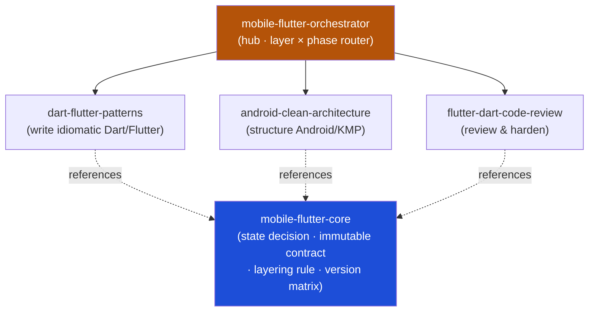

<div align="center">


</div>

<div align="center">

[](../../LICENSE)
[](../../skills.sh.json)
[](https://flutter.dev)
[](https://dart.dev)
[](https://skills.sh/)

**Five skills behind one router for Flutter/Dart and Android/KMP work.**
Writing, structuring, or reviewing a mobile app? The orchestrator places your task on the
**layer × phase** map and routes; `mobile-flutter-core` holds the state-management decision they all share.

</div>


## What it is

5 skills: `mobile-flutter-orchestrator` (router) + `mobile-flutter-core` (shared model) + 3
specialist spokes. The cluster's job is to make a deep mobile skill set *navigable* — the
orchestrator knows which spoke to reach for, and the core keeps the interlocking decisions
(state management → immutability → layering → tooling) consistent so no spoke contradicts another.



## Skills

| Concern | Skill | Role |
|---|---|---|
| **Router** | `mobile-flutter-orchestrator` | Intent router over the layer × phase map |
| **Shared model** | `mobile-flutter-core` | State-management decision, immutable contract, layering rule, version/tooling matrix |
| **Write** | `dart-flutter-patterns` | Production Dart 3 / Flutter patterns — null safety, sealed state, async, widgets, BLoC + Riverpod, GoRouter, Dio, Freezed, testing |
| **Structure** | `android-clean-architecture` | Module boundaries & dependency rules for Android/KMP — UseCases, Repositories, Room/SQLDelight/Ktor, Koin/Hilt |
| **Review** | `flutter-dart-code-review` | Library-agnostic review checklist across 15 axes (widgets, state, perf, a11y, security, l10n, DI, static analysis) |

## The decision that ties it together

The cluster turns on **one choice: which state-management solution** — and that choice
constrains immutability, testing, rebuild discipline, and DI downstream:

```
state solution ──implies──> immutable-state contract ──shapes──> layering + testing + rebuilds
```

Pick one solution and one routing approach per app; model mutually-exclusive states as sealed
types (not boolean flags); keep `domain` framework-pure; `mounted`-check `BuildContext` after
every `await`. Full model in [`mobile-flutter-core`](../../skills/mobile-flutter-core/SKILL.md).

## Install

```bash
npx skills add Sheshiyer/skill-clusters@mobile-flutter-orchestrator -g -y   # entry point
npx skills add Sheshiyer/skill-clusters@dart-flutter-patterns -g -y         # any spoke
```

## Local development

Part of the [`skill-clusters`](../../README.md) monorepo; the repo is the single source of truth.

```bash
./scripts/link-agents.sh --apply    # symlink ~/.agents/skills → these canonical copies
```
