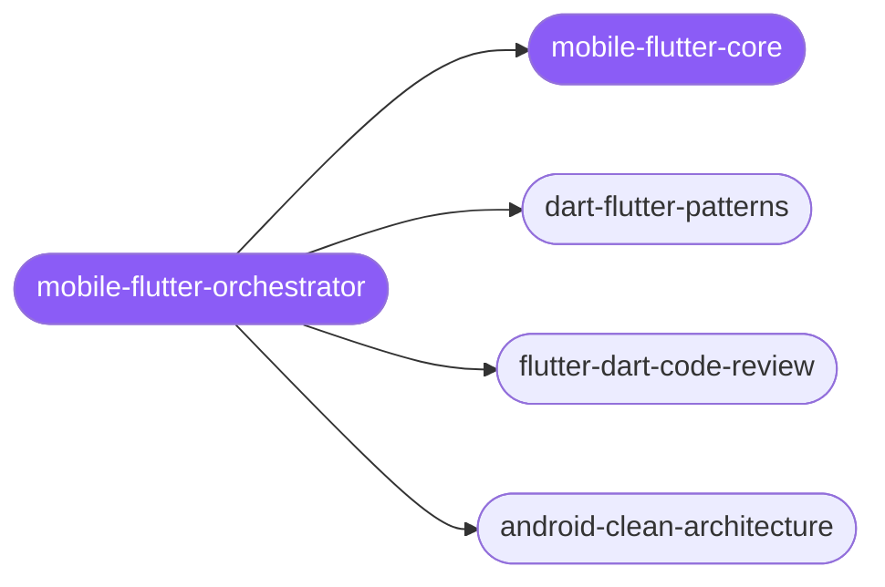

<div align="center">

</div>

<div align="center">

[](../../profiles.json)
[](#skills)
[](../../NOTICE)
[](https://skills.sh/)

</div>

> The single entry skill for Flutter/Dart (and Android/KMP) work: it locates a task on the layer × phase map — UI / state / data / build, write → review — and delegates to the right specialist spoke. The cross-cutting decision every app turns on (which state-management solution, and the immutable-state contract it implies) plus shared conventions live in `mobile-flutter-core`.

## Hub-and-spoke



## Skills

| Skill | Role | Loaded at startup |
|---|---|---|
| `mobile-flutter-orchestrator` | 🧭 hub · router | ✅ enumerated |
| `mobile-flutter-core` | 📐 hub · shared reference | ✅ enumerated |
| `dart-flutter-patterns` | spoke | ⤵ on-demand |
| `flutter-dart-code-review` | spoke | ⤵ on-demand |
| `android-clean-architecture` | spoke | ⤵ on-demand |

## Tier & loading

Off by default — 0 startup cost. Activate with `node scripts/tier.mjs --activate mobile-flutter --apply`.

## Install

```bash
npx skills add Sheshiyer/skill-clusters@mobile-flutter-orchestrator -g -y
```

## Attribution

Spoke content wholly or substantially extracted from [ECC](https://github.com/affaan-m/ECC) (MIT). See [../../NOTICE](../../NOTICE).

---
<sub>Part of <a href="../../README.md">skill-clusters</a> — the conductor closed-loop system · <a href="../../docs/CONDUCTOR-INTEGRATION.md">how it's wired</a></sub>
