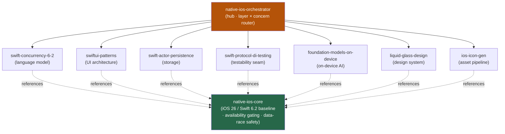

<div align="center">


</div>

<div align="center">

[](../../LICENSE)
[](../../skills.sh.json)
[](https://swift.org)
[](https://developer.apple.com)
[](https://skills.sh/)

**Native Apple-platform development behind a single router.**
Building, modernizing, or shipping a Swift / SwiftUI app? The orchestrator places your task on the
**layer × concern** map and routes; `native-ios-core` holds the iOS 26 / Swift 6.2 baseline they all share.

</div>


## What it is

9 skills: `native-ios-orchestrator` (router) + `native-ios-core` (shared model) + 7 Swift
specialists. The cluster's job is to make the new Apple stack *navigable* — the orchestrator knows
which spoke to reach for, and the core keeps the interlocking facts (the iOS 26 / Swift 6.2 / Xcode
26 baseline, availability gating, and the actor-isolation data-race model) consistent so no spoke
contradicts another.



## Skills by concern

| Concern | Spokes |
|---|---|
| **Router / model** | `native-ios-orchestrator`, `native-ios-core` |
| **Language & concurrency** | `swift-concurrency-6-2` |
| **UI architecture** | `swiftui-patterns` |
| **Storage** | `swift-actor-persistence` |
| **Testability** | `swift-protocol-di-testing` |
| **On-device AI** | `foundation-models-on-device` |
| **Design system** | `liquid-glass-design` |
| **Assets** | `ios-icon-gen` |

## The model that ties it together

Everything targets **one toolchain line**:

```
Xcode 26 ──compiles──> Swift 6.2 ──targets──> iOS 26 / macOS 26 (with graceful fallback)
```

The flagship frameworks (Approachable Concurrency, Liquid Glass, on-device FoundationModels) only
exist on this line — so the first question is always *"what's the deployment target, and is this API
available there?"* Gate every iOS 26-only API (`if #available`, `SystemLanguageModel.availability`)
with a real fallback; keep concurrency isolated-by-default. Full model in
[`native-ios-core`](../../skills/native-ios-core/SKILL.md).

## Install

```bash
npx skills add Sheshiyer/skill-clusters@native-ios-orchestrator -g -y     # entry point
npx skills add Sheshiyer/skill-clusters@liquid-glass-design -g -y          # any spoke
```

## Local development

Part of the [`skill-clusters`](../../README.md) monorepo; the repo is the single source of truth.

```bash
./scripts/link-agents.sh --apply    # symlink ~/.agents/skills → these canonical copies
```
