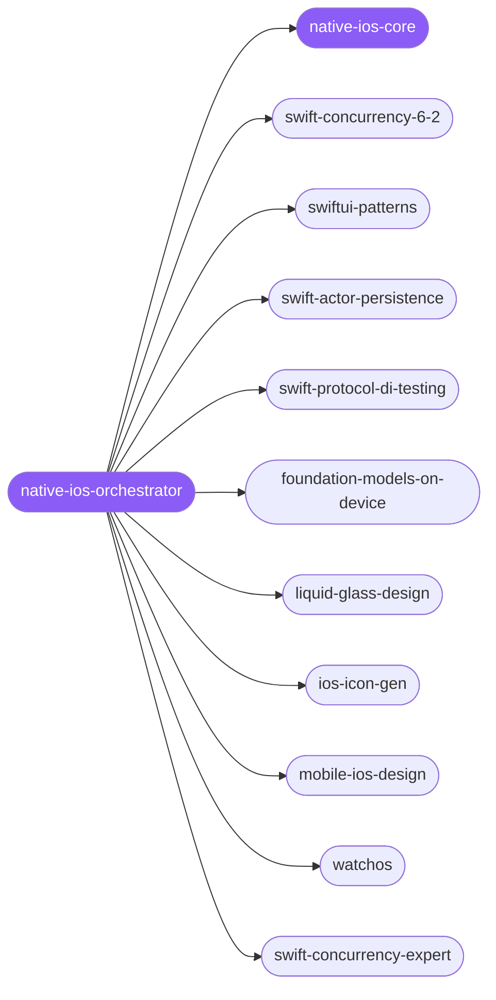

<div align="center">

</div>

<div align="center">

[](../../profiles.json)
[](#skills)
[](../../NOTICE)
[](https://skills.sh/)

</div>

> The single entry skill for native Apple-platform (Swift / SwiftUI) work: it locates a task on the **layer × concern** map — language, UI architecture, persistence, testing, on-device AI, design, assets — and delegates to the right specialist spoke. Every spoke shares the **iOS 26 / Swift 6.2 / Xcode 26 baseline**, its availability-gating discipline, and the data-race-safety model, all of which live in `native-ios-core`.

## Hub-and-spoke



_…and 8 more in the table below._

## Skills

| Skill | Role | Loaded at startup |
|---|---|---|
| `native-ios-orchestrator` | 🧭 hub · router | ✅ enumerated |
| `native-ios-core` | 📐 hub · shared reference | ✅ enumerated |
| `swiftui-patterns` | spoke | ⤵ on-demand |
| `swift-concurrency-6-2` | spoke | ⤵ on-demand |
| `swift-actor-persistence` | spoke | ⤵ on-demand |
| `swift-protocol-di-testing` | spoke | ⤵ on-demand |
| `foundation-models-on-device` | spoke | ⤵ on-demand |
| `ios-icon-gen` | spoke | ⤵ on-demand |
| `liquid-glass-design` | spoke | ⤵ on-demand |
| `watchos` | spoke | ⤵ on-demand |
| `mobile-ios-design` | spoke | ⤵ on-demand |
| `app-store-changelog` | spoke | ⤵ on-demand |
| `ios-debugger-agent` | spoke | ⤵ on-demand |
| `macos-menubar-tuist-app` | spoke | ⤵ on-demand |
| `macos-spm-app-packaging` | spoke | ⤵ on-demand |
| `swift-concurrency-expert` | spoke | ⤵ on-demand |
| `swiftui-liquid-glass` | spoke | ⤵ on-demand |
| `swiftui-performance-audit` | spoke | ⤵ on-demand |
| `swiftui-ui-patterns` | spoke | ⤵ on-demand |
| `swiftui-view-refactor` | spoke | ⤵ on-demand |

## Tier & loading

Enumerated at CLI startup (orchestrator + core); spokes load on demand from `~/.agents/skill-clusters/skills/<name>/SKILL.md`.

## Install

```bash
npx skills add Sheshiyer/skill-clusters@native-ios-orchestrator -g -y
```

## Attribution

Primary source: **antigravity-awesome-skills** (upstream: Dimillian/Skills, MIT) for the picked-up workflow spokes — review, fix, refactor, audit, debug, package, ship. The architecture, persistence, AI, and design spokes are authored for skill-clusters (MIT) — so this cluster is **antigravity + mixed**. See [NOTICE](../../NOTICE).

---
<sub>Part of <a href="../../README.md">skill-clusters</a> — the conductor closed-loop system · <a href="../../docs/CONDUCTOR-INTEGRATION.md">how it's wired</a></sub>
