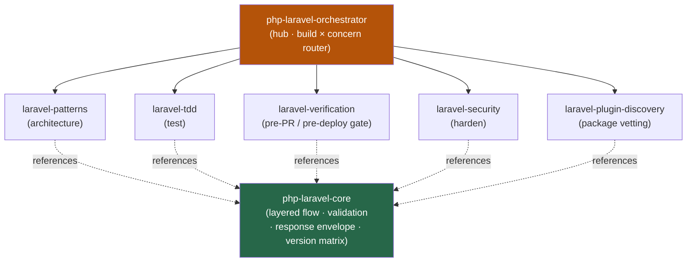

<div align="center">


</div>

<div align="center">

[](../../LICENSE)
[](../../skills.sh.json)
[](https://laravel.com)
[](https://php.net)
[](https://skills.sh/)

**Five Laravel specialists behind a single router.**
Building, testing, hardening, or shipping a Laravel app? The orchestrator places your task on the
**build × concern** map and routes; `php-laravel-core` holds the layering and conventions they all share.

</div>


## What it is

7 skills: `php-laravel-orchestrator` (router) + `php-laravel-core` (shared model) + 5
specialists. The cluster's job is to make Laravel work *navigable* — the orchestrator knows which
spoke to reach for, and the core keeps the cross-cutting conventions (thin controllers → service →
action → model, Form Request validation, the JSON response envelope, the test/verify pipeline)
consistent so no two spokes contradict each other.



## Skills by concern

| Concern | Spokes |
|---|---|
| **Router / model** | `php-laravel-orchestrator`, `php-laravel-core` |
| **Build (architecture)** | `laravel-patterns` |
| **Test** | `laravel-tdd` |
| **Verify (pre-PR / pre-deploy)** | `laravel-verification` |
| **Harden (security)** | `laravel-security` |
| **Package vetting** | `laravel-plugin-discovery` |

## The model that ties it together

Every request crosses the **same one-way pipeline** — logic flows down, never back up:

```
Request ─> Form Request (validate + authorize) ─> Controller (thin)
        ─> Service ─> Action ─> Model ─> API Resource ─> { success, data, error, meta }
```

Keep controllers thin; validate every input in a Form Request; default-deny on authorization; and
every API response uses the same four-key envelope. Full model in
[`php-laravel-core`](../../skills/php-laravel-core/SKILL.md).

## Install

```bash
npx skills add Sheshiyer/skill-clusters@php-laravel-orchestrator -g -y     # entry point
npx skills add Sheshiyer/skill-clusters@laravel-security -g -y             # any spoke
```

## Local development

Part of the [`skill-clusters`](../../README.md) monorepo; the repo is the single source of truth.

```bash
./scripts/link-agents.sh --apply    # symlink ~/.agents/skills → these canonical copies
```
