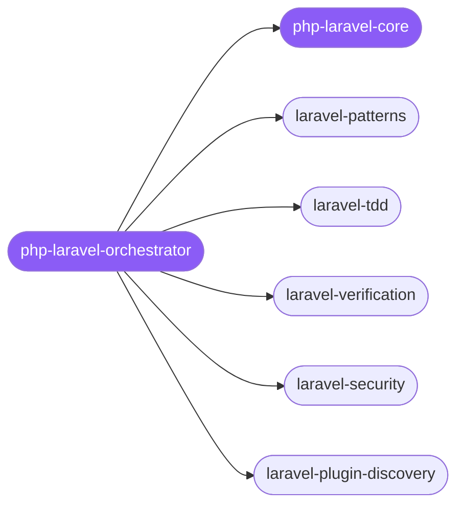

<div align="center">

</div>

<div align="center">

[](../../profiles.json)
[](#skills)
[](../../NOTICE)
[](https://skills.sh/)

</div>

> The single entry skill for Laravel work. It places a build → test → verify → ship task on the lifecycle and delegates to one of five specialists — architecture (controller → service → action → Eloquent), TDD with Pest/PHPUnit, the pre-PR/pre-deploy verification gate, security hardening, and Composer package discovery — with the cross-cutting layering, validation, and response-envelope conventions living in `php-laravel-core`.

## Hub-and-spoke



## Skills

| Skill | Role | Loaded at startup |
|---|---|---|
| `php-laravel-orchestrator` | 🧭 hub · router | ✅ enumerated |
| `php-laravel-core` | 📐 hub · shared reference | ✅ enumerated |
| `laravel-patterns` | spoke | ⤵ on-demand |
| `laravel-tdd` | spoke | ⤵ on-demand |
| `laravel-verification` | spoke | ⤵ on-demand |
| `laravel-security` | spoke | ⤵ on-demand |
| `laravel-plugin-discovery` | spoke | ⤵ on-demand |

## Tier & loading

Off by default — 0 startup cost. Activate with `node scripts/tier.mjs --activate php-laravel --apply`.

## Install

```bash
npx skills add Sheshiyer/skill-clusters@php-laravel-orchestrator -g -y
```

## Attribution

Primary source: **ECC** (`affaan-m/ECC`, MIT). See [NOTICE](../../NOTICE).

---
<sub>Part of <a href="../../README.md">skill-clusters</a> — the conductor closed-loop system · <a href="../../docs/CONDUCTOR-INTEGRATION.md">how it's wired</a></sub>
