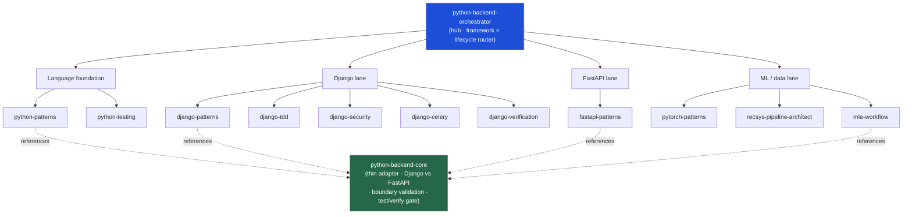

<div align="center">


</div>

<div align="center">

[](../../LICENSE)
[](../../skills.sh.json)
[](https://www.python.org)
[](https://www.djangoproject.com)
[](https://fastapi.tiangolo.com)
[](https://skills.sh/)

**11 Python backend & ML specialists behind a single router.**
Building, testing, securing, or shipping a Python web or ML backend? The orchestrator places
your task on the **framework × lifecycle** map and routes; `python-backend-core` holds the
thin-adapter model and the Django-vs-FastAPI decision they all share.

</div>


## What it is

13 skills: `python-backend-orchestrator` (router) + `python-backend-core` (shared model) + 11
specialists spanning the language foundation, the Django stack, FastAPI, and the ML lane. The
cluster makes a broad skill set *navigable* — the orchestrator knows which specialist to reach
for, and the core keeps the interlocking conventions (thin adapter over a typed core, boundary
validation, the test/verify gate) consistent across every spoke.



## Skills by lane

| Lane | Spokes |
|---|---|
| **Router / model** | `python-backend-orchestrator`, `python-backend-core` |
| **Language foundation** | `python-patterns`, `python-testing` |
| **Django** | `django-patterns`, `django-tdd`, `django-security`, `django-celery`, `django-verification` |
| **FastAPI** | `fastapi-patterns` |
| **ML / data** | `pytorch-patterns`, `recsys-pipeline-architect`, `mle-workflow` |

## The model that ties it together

The web/API layer is a **thin adapter** over a typed, tested core:

```
Request ──> Boundary (validate + parse) ──> Service / domain (typed, framework-free) ──> Persistence
```

Keep business logic out of views/routers; validate every input at the boundary (DRF serializers
or Pydantic models); no feature is done until tests cover it and the verify gate passes. Pick
Django (batteries-included, ORM, admin, DRF) or FastAPI (async-first, schema-driven) once per
service — the tie-breaker and full model live in
[`python-backend-core`](../../skills/python-backend-core/SKILL.md).

## Install

```bash
npx skills add Sheshiyer/skill-clusters@python-backend-orchestrator -g -y   # entry point
npx skills add Sheshiyer/skill-clusters@django-patterns -g -y               # any spoke
```

## Local development

Part of the [`skill-clusters`](../../README.md) monorepo; the repo is the single source of truth.

```bash
./scripts/link-agents.sh --apply    # symlink ~/.agents/skills → these canonical copies
```
