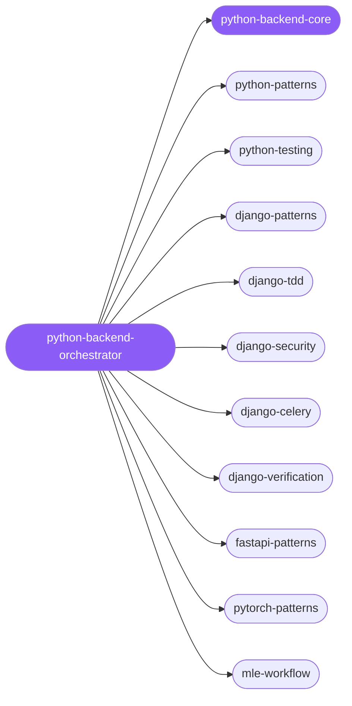

<div align="center">

</div>

<div align="center">

[](../../profiles.json)
[](#skills)
[](../../NOTICE)
[](https://skills.sh/)

</div>

> The single entry skill for Python server-side and ML-engineering work — it locates a task on the framework × lifecycle map (idiomatic Python, pytest/TDD, the Django stack, FastAPI services, the PyTorch/recsys/MLE lane) and delegates to the right specialist. The cross-cutting model every spoke shares — the web/API layer is a thin adapter over a typed, tested core; validate at the boundary; gate every change through the test/verify loop — lives in `python-backend-core`.

## Hub-and-spoke



_…and 7 more in the table below._

## Skills

| Skill | Role | Loaded at startup |
|---|---|---|
| `python-backend-orchestrator` | 🧭 hub · router | ✅ enumerated |
| `python-backend-core` | 📐 hub · shared reference | ✅ enumerated |
| `python-patterns` | spoke | ⤵ on-demand |
| `python-testing` | spoke | ⤵ on-demand |
| `django-patterns` | spoke | ⤵ on-demand |
| `django-tdd` | spoke | ⤵ on-demand |
| `django-verification` | spoke | ⤵ on-demand |
| `django-security` | spoke | ⤵ on-demand |
| `django-celery` | spoke | ⤵ on-demand |
| `fastapi-patterns` | spoke | ⤵ on-demand |
| `pytorch-patterns` | spoke | ⤵ on-demand |
| `recsys-pipeline-architect` | spoke | ⤵ on-demand |
| `mle-workflow` | spoke | ⤵ on-demand |
| `textual` | spoke | ⤵ on-demand |
| `ai-native-cli` | spoke | ⤵ on-demand |
| `discord-bot-architect` | spoke | ⤵ on-demand |
| `hubspot-integration` | spoke | ⤵ on-demand |
| `skill-rails-upgrade` | spoke | ⤵ on-demand |
| `slack-bot-builder` | spoke | ⤵ on-demand |

## Tier & loading

Enumerated at CLI startup (orchestrator + core); spokes load on demand from `~/.agents/skill-clusters/skills/<name>/SKILL.md`.

## Install

```bash
npx skills add Sheshiyer/skill-clusters@python-backend-orchestrator -g -y
```

## Attribution

Primary source: **ECC** (affaan-m/ECC, MIT) — the Python / Django / PyTorch / MLE specialist spokes. Picked-up spokes come from antigravity-awesome-skills (MIT); the FastAPI and recsys spokes are authored for skill-clusters (MIT). Mixed sources — see [NOTICE](../../NOTICE).

---
<sub>Part of <a href="../../README.md">skill-clusters</a> — the conductor closed-loop system · <a href="../../docs/CONDUCTOR-INTEGRATION.md">how it's wired</a></sub>
