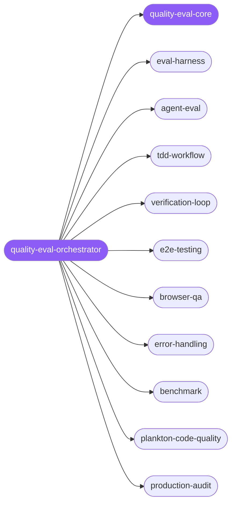

<div align="center">

</div>

<div align="center">

[](../../profiles.json)
[](#skills)
[](../../NOTICE)
[](https://skills.sh/)

</div>

> The single entry point for proving software — and the agents that write it — actually works. It places a quality/testing/evaluation task on the gate-stage × subject map (write → commit → CI → ship) and delegates to one of its specialist spokes; the shared model of the four gates, the evidence ladder, and `pass@k` vs a single green run lives in `quality-eval-core`.

## Hub-and-spoke



_…and 11 more in the table below._

## Skills

| Skill | Role | Loaded at startup |
|---|---|---|
| `quality-eval-orchestrator` | 🧭 hub · router | ✅ enumerated |
| `quality-eval-core` | 📐 hub · shared reference | ✅ enumerated |
| `eval-harness` | spoke | ⤵ on-demand |
| `agent-eval` | spoke | ⤵ on-demand |
| `tdd-workflow` | spoke | ⤵ on-demand |
| `verification-loop` | spoke | ⤵ on-demand |
| `e2e-testing` | spoke | ⤵ on-demand |
| `windows-desktop-e2e` | spoke | ⤵ on-demand |
| `ai-regression-testing` | spoke | ⤵ on-demand |
| `browser-qa` | spoke | ⤵ on-demand |
| `error-handling` | spoke | ⤵ on-demand |
| `benchmark` | spoke | ⤵ on-demand |
| `plankton-code-quality` | spoke | ⤵ on-demand |
| `production-audit` | spoke | ⤵ on-demand |
| `evals` | spoke | ⤵ on-demand |
| `optimize` | spoke | ⤵ on-demand |
| `autoresearch` | spoke | ⤵ on-demand |
| `markdown-rendering-regression` | spoke | ⤵ on-demand |
| `accesslint-scan` | spoke | ⤵ on-demand |
| `accesslint-diff` | spoke | ⤵ on-demand |
| `fix-review` | spoke | ⤵ on-demand |
| `simplify-code` | spoke | ⤵ on-demand |
| `clean-code` | spoke | ⤵ on-demand |

## Tier & loading

Enumerated at CLI startup (orchestrator + core); spokes load on demand from `~/.agents/skill-clusters/skills/<name>/SKILL.md`.

## Install

```bash
npx skills add Sheshiyer/skill-clusters@quality-eval-orchestrator -g -y
```

## Attribution

Primary source: **ECC** (affaan-m/ECC, MIT) — see [NOTICE](../../NOTICE). Spokes are mixed: also draws from antigravity-awesome-skills (MIT), the wider agent skills library, and skills authored for skill-clusters (MIT). + mixed.

---
<sub>Part of <a href="../../README.md">skill-clusters</a> — the conductor closed-loop system · <a href="../../docs/CONDUCTOR-INTEGRATION.md">how it's wired</a></sub>
