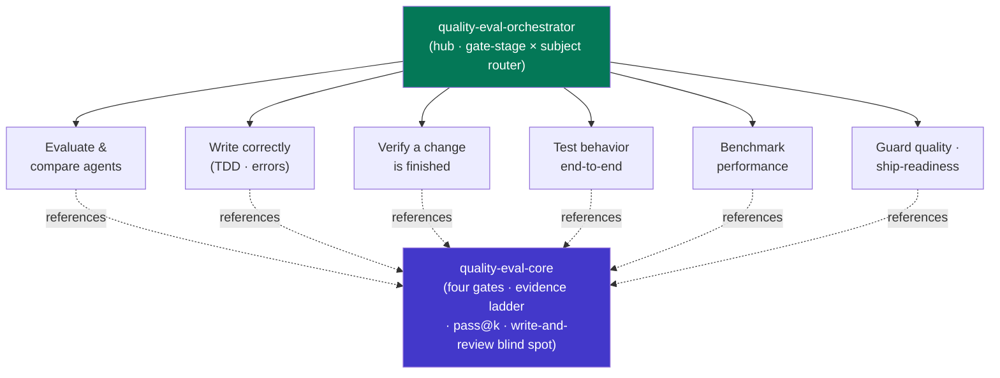

<div align="center">


</div>

<div align="center">

[](../../LICENSE)
[](../../skills.sh.json)
[](../../skills/quality-eval-core/SKILL.md)
[](https://skills.sh/)

**Prove it works — and prove the agent that wrote it works.**
Testing, verifying, evaluating, benchmarking, or hardening code? The orchestrator places
your task on the **gate-stage × subject** map and routes; `quality-eval-core` holds the
four-gate model and the evidence ladder they all share.

</div>


## What it is

14 skills: `quality-eval-orchestrator` (router) + `quality-eval-core` (shared model) + 12
specialist spokes covering evaluation, TDD, verification, E2E (web + Windows desktop),
AI-regression and browser QA, error handling, performance benchmarking, write-time linting,
and production-readiness audits. The cluster's job is to make "is this actually done?"
answerable with evidence instead of vibes — the orchestrator knows which gate to reach for,
and the core keeps the interlocking concepts (the four gates, the evidence ladder, `pass@k`,
the AI write-and-review blind spot) consistent.



## Skills by gate stage

| Gate stage | Spokes |
|---|---|
| **Router / model** | `quality-eval-orchestrator`, `quality-eval-core` |
| **Evaluate & compare** | `eval-harness`, `agent-eval` |
| **Write correctly** | `tdd-workflow`, `error-handling` |
| **Verify (commit-time)** | `verification-loop`, `ai-regression-testing` |
| **Test end-to-end (CI)** | `e2e-testing`, `windows-desktop-e2e`, `browser-qa` |
| **Benchmark** | `benchmark` |
| **Guard & ship** | `plankton-code-quality`, `production-audit` |

## The model that ties it together

Quality is enforced at **four gates**, cheapest-and-earliest first — each catches a
different failure class:

```
Edit ──write──> Commit ──commit──> CI ──build──> Release ──ship──> Prod
```

Push every check to the **earliest** gate that can catch it; climb the **evidence ladder**
(asserted → ran → tested → measured → reproduced) before claiming a pass; judge anything
stochastic by its `pass@k` **rate**, not a lucky single green run; and never let the thing
under test grade itself. Full model in
[`quality-eval-core`](../../skills/quality-eval-core/SKILL.md).

## Install

```bash
npx skills add Sheshiyer/skill-clusters@quality-eval-orchestrator -g -y   # entry point
npx skills add Sheshiyer/skill-clusters@e2e-testing -g -y                 # any spoke
```

## Local development

Part of the [`skill-clusters`](../../README.md) monorepo; the repo is the single source of truth.

```bash
./scripts/link-agents.sh --apply    # symlink ~/.agents/skills → these canonical copies
```
