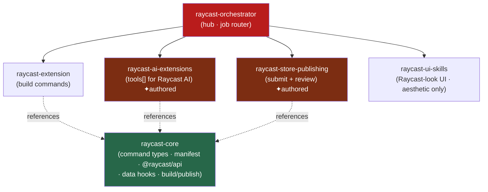

<div align="center">


</div>

<div align="center">

[](../../LICENSE)
[](../../skills.sh.json)
[](https://developers.raycast.com)
[](https://skills.sh/)

**Hub-and-spoke cluster for Raycast.**
The orchestrator separates the four jobs people mean by "Raycast" — build an extension, make it
AI-callable, publish to the Store, or design a Raycast-looking app — and routes. `raycast-core`
holds the extension model. *(2 authored spokes fill the AI + publishing gaps.)*

</div>


## What it is

`raycast-orchestrator` + `raycast-core` + 4 spokes. The two existing skills were thin (and one,
`raycast-ui-skills`, is actually about *mimicking* Raycast's look — not building extensions), so
this cluster adds a real model plus **authored** `raycast-ai-extensions` and
`raycast-store-publishing` spokes.



## Skills

| Skill | Role | |
|---|---|---|
| `raycast-orchestrator` | Router — job → spoke | |
| `raycast-core` | Command types, manifest, `@raycast/api`, data hooks, build/publish | |
| `raycast-extension` | Build extensions/commands (React + TS) | |
| `raycast-ai-extensions` | `tools[]` the Raycast AI can call | ✦ authored |
| `raycast-store-publishing` | Package + submit + pass review | ✦ authored |
| `raycast-ui-skills` | Raycast aesthetic for your *own* app | |

## Two jobs people conflate

- **Build an extension** that runs *inside* Raycast → `raycast-extension` + `raycast-core`.
- **Design your app** to *look like* Raycast (light mode, Inter, 4px grid) → `raycast-ui-skills`.

Full extension model in [`raycast-core`](../../skills/raycast-core/SKILL.md).

## Install

```bash
npx skills add Sheshiyer/skill-clusters@raycast-orchestrator -g -y
```

## Local development

Part of the [`skill-clusters`](../../README.md) monorepo (repo = single source of truth):

```bash
./scripts/link-agents.sh --apply
```
