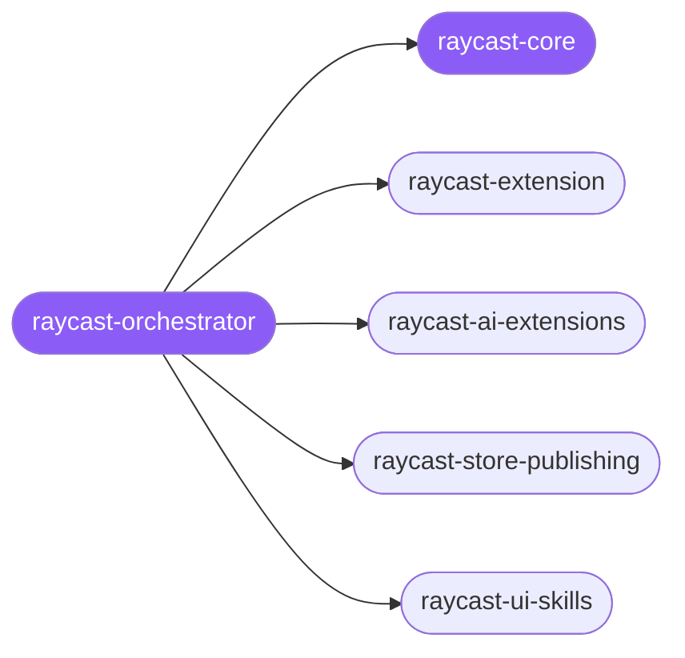

<div align="center">

</div>

<div align="center">

[](../../profiles.json)
[](#skills)
[](../../NOTICE)
[](https://skills.sh/)

</div>

> Separates the four distinct jobs people mean by "Raycast" — build an extension/command, build an AI extension (tools the Raycast AI calls), publish to the Store, or design a Raycast-aesthetic UI in your own app — and routes accordingly. The shared extension model (command types, the `package.json` manifest, `@raycast/api`, data, build/publish) lives in `raycast-core`.

## Hub-and-spoke



## Skills

| Skill | Role | Loaded at startup |
| --- | --- | --- |
| `raycast-orchestrator` | 🧭 hub · router | ✅ enumerated |
| `raycast-core` | 📐 hub · shared reference | ✅ enumerated |
| `raycast-extension` | spoke | ⤵ on-demand |
| `raycast-ai-extensions` | spoke | ⤵ on-demand |
| `raycast-store-publishing` | spoke | ⤵ on-demand |
| `raycast-ui-skills` | spoke | ⤵ on-demand |

## Tier & loading

Enumerated at CLI startup (orchestrator + core); spokes load on demand from `~/.agents/skill-clusters/skills/<name>/SKILL.md`.

## Install

```bash
npx skills add Sheshiyer/skill-clusters@raycast-orchestrator -g -y
```

## Attribution

Authored for skill-clusters (MIT) + mixed — `raycast-ui-skills` is community-sourced (MIT, from raycast.com). See [NOTICE](../../NOTICE).

---
<sub>Part of <a href="../../README.md">skill-clusters</a> — the conductor closed-loop system · <a href="../../docs/CONDUCTOR-INTEGRATION.md">how it's wired</a></sub>
