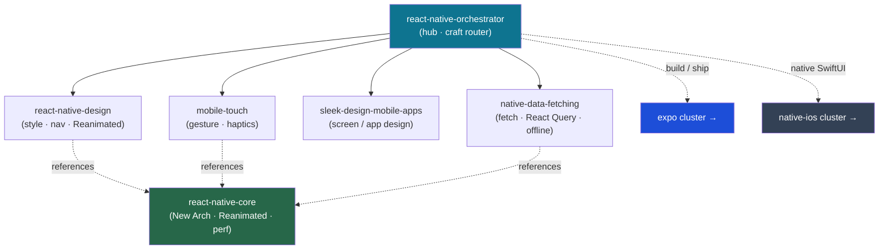

<div align="center">


</div>

<div align="center">

[](../../LICENSE)
[](../../skills.sh.json)
[](https://reactnative.dev)
[](https://skills.sh/)

**Hub-and-spoke cluster for React Native UI & interaction craft — toolchain-agnostic.**
Styling, navigation, Reanimated motion, gestures, and data. The orchestrator routes by what
you're crafting; `react-native-core` holds the runtime model (New Architecture, Reanimated,
performance). Toolchain lives in **[expo](../expo)**; native SwiftUI in **native-ios**.

</div>


## What it is

`react-native-orchestrator` (router) + `react-native-core` (runtime model) + the craft spokes.
It separates *what you build* (UI, motion, touch, screens, data) from *how you ship it* (the
expo cluster) — so RN UI knowledge stays reusable whether the app is Expo-managed or bare.



## Skills

| Skill | Role |
|---|---|
| `react-native-orchestrator` | Router — craft → spoke |
| `react-native-core` | New Architecture, styling, navigation, Reanimated, performance |
| `react-native-design` | Styling, navigation, Reanimated animations |
| `mobile-touch` | Gestures, haptics, touch interactions |
| `sleek-design-mobile-apps` | High-level screen / app design |
| `native-data-fetching` | *(shared)* fetch / React Query / SWR / offline |

## The model that ties it together

Animations and gestures run in **Reanimated worklets on the UI thread** (never block JS);
animate `transform`/`opacity` for 60fps; **virtualize long lists** (FlatList/FlashList); pick
**one navigation paradigm** per app. Full model in
[`react-native-core`](../../skills/react-native-core/SKILL.md).

## Install

```bash
npx skills add Sheshiyer/skill-clusters@react-native-orchestrator -g -y
```

## Local development

Part of the [`skill-clusters`](../../README.md) monorepo (repo = single source of truth):

```bash
./scripts/link-agents.sh --apply
```
