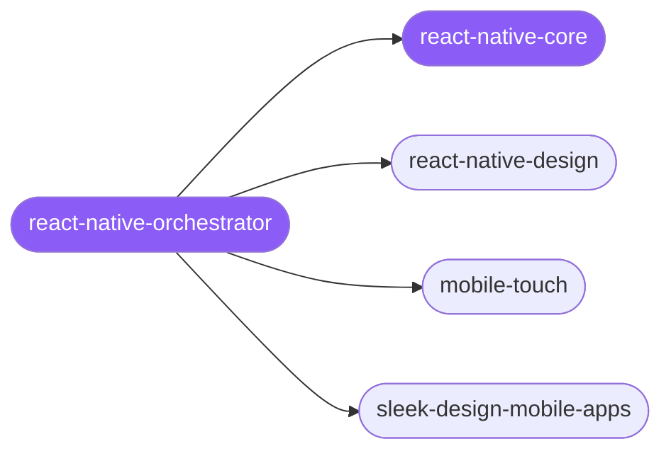

<div align="center">

</div>

<div align="center">

[](../../profiles.json)
[](#skills)
[](../../NOTICE)
[](https://skills.sh/)

</div>

> Routes a React Native UI and interaction craft task to the right spoke — styling/navigation/Reanimated animation, touch/gesture/haptics, full screen/app visual design, or integrated product-flow UI/UX audits — independent of how the app is built or shipped. The runtime model (New Architecture, Reanimated, navigation, performance) lives in `react-native-core`; toolchain/build/ship hands off to the expo cluster.

## Hub-and-spoke



## Skills

| Skill | Role | Loaded at startup |
| --- | --- | --- |
| `react-native-orchestrator` | 🧭 hub · router | ✅ enumerated |
| `react-native-core` | 📐 hub · shared reference | ✅ enumerated |
| `react-native-design` | spoke | ⤵ on-demand |
| `mobile-touch` | spoke | ⤵ on-demand |
| `sleek-design-mobile-apps` | spoke | ⤵ on-demand |

## Tier & loading

Enumerated at CLI startup (orchestrator + core); spokes load on demand from `~/.agents/skill-clusters/skills/<name>/SKILL.md`.

## Install

```bash
npx skills add Sheshiyer/skill-clusters@react-native-orchestrator -g -y
```

## Attribution

Authored for skill-clusters (MIT). See [NOTICE](../../NOTICE).

---
<sub>Part of <a href="../../README.md">skill-clusters</a> — the conductor closed-loop system · <a href="../../docs/CONDUCTOR-INTEGRATION.md">how it's wired</a></sub>
