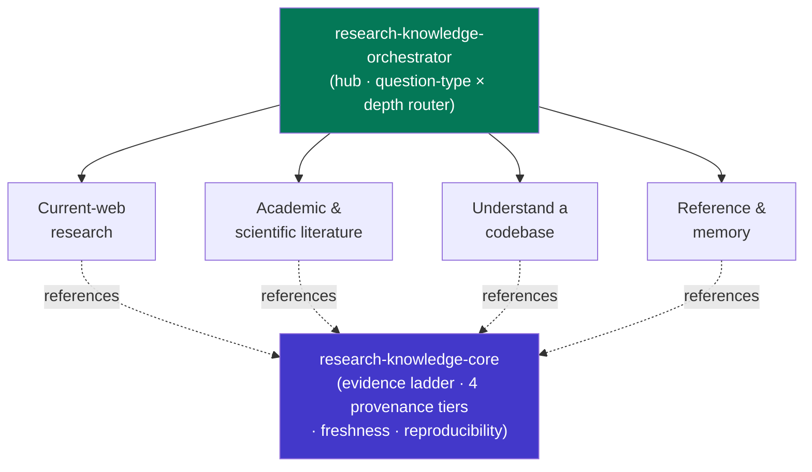

<div align="center">


</div>

<div align="center">

[](../../LICENSE)
[](../../skills.sh.json)
[](../../skills/research-knowledge-core/SKILL.md)
[](https://skills.sh/)

**Research, literature, and codebase knowledge — 12 specialists behind a single router.**
Researching, reviewing the literature, looking something up, or understanding a repo? The
orchestrator places your task on the **question type × evidence depth** map and routes;
`research-knowledge-core` holds the evidence ladder and provenance discipline they all share.

</div>


## What it is

14 skills: `research-knowledge-orchestrator` (router) + `research-knowledge-core` (shared
model) + 12 specialists. The cluster's job is to make a broad knowledge-gathering toolkit
*navigable and trustworthy* — the orchestrator knows which spoke to reach for, and the core
keeps the cross-cutting discipline (lightest lane first, four provenance tiers, dated &
reproducible sources) consistent across web research, scientific databases, and code comprehension.



## Skills by concern

| Concern | Spokes |
|---|---|
| **Router / model** | `research-knowledge-orchestrator`, `research-knowledge-core` |
| **Current-web research** | `research-ops`, `exa-search`, `deep-research` |
| **Academic & scientific literature** | `scientific-thinking-literature-review`, `scientific-thinking-scholar-evaluation`, `scientific-db-pubmed-database`, `scientific-db-uspto-database`, `scientific-pkg-gget` |
| **Understand a codebase** | `codebase-onboarding`, `code-tour` |
| **Reference & memory** | `documentation-lookup`, `ck` |

## The model that ties it together

Two interlocking rules. **Climb the evidence ladder** — start at the cheapest lane that
answers the question and escalate only when synthesis or verification demands it:

```
local / docs / ck memory  →  fast discovery (exa, one DB query)  →  multi-source synthesis  →  evaluation
```

And **label every claim by provenance** — sourced fact · supplied context · inference ·
recommendation — so nothing misleads. Full model in
[`research-knowledge-core`](../../skills/research-knowledge-core/SKILL.md).

## Install

```bash
npx skills add Sheshiyer/skill-clusters@research-knowledge-orchestrator -g -y   # entry point
npx skills add Sheshiyer/skill-clusters@deep-research -g -y                     # any spoke
```

## Local development

Part of the [`skill-clusters`](../../README.md) monorepo; the repo is the single source of truth.

```bash
./scripts/link-agents.sh --apply    # symlink ~/.agents/skills → these canonical copies
```
