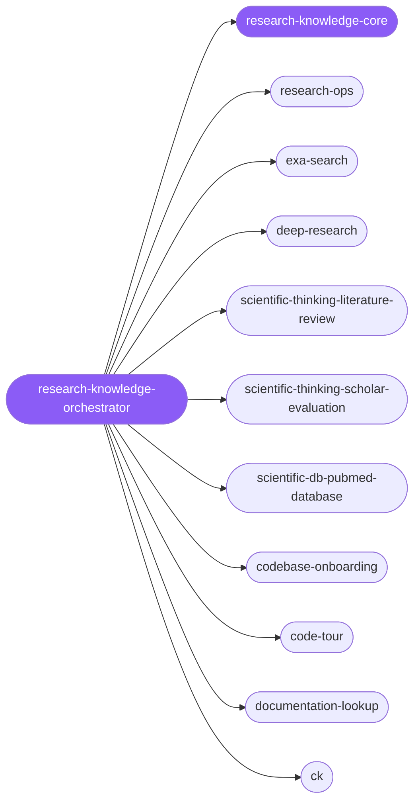

<div align="center">

</div>

<div align="center">

[](../../profiles.json)
[](#skills)
[](../../NOTICE)
[](https://skills.sh/)

</div>

> The single entry skill for research and knowledge work: it locates a task on the **question type × evidence depth** map and delegates to one of its specialist spokes — current-web research, neural discovery, multi-source cited synthesis, systematic literature review, scholarly evaluation, biomedical/patent/genomic databases, codebase onboarding, guided code tours, live docs lookup, and persistent project memory. The shared discipline every spoke carries — pick the lightest evidence lane that answers the question, label every claim by provenance, escalate only when synthesis demands it — lives in `research-knowledge-core`.

## Hub-and-spoke



_…and 20 more in the table below._

## Skills

| Skill | Role | Loaded at startup |
|---|---|---|
| `research-knowledge-orchestrator` | 🧭 hub · router | ✅ enumerated |
| `research-knowledge-core` | 📐 hub · shared reference | ✅ enumerated |
| `research-ops` | spoke | ⤵ on-demand |
| `exa-search` | spoke | ⤵ on-demand |
| `deep-research` | spoke | ⤵ on-demand |
| `scientific-thinking-literature-review` | spoke | ⤵ on-demand |
| `scientific-thinking-scholar-evaluation` | spoke | ⤵ on-demand |
| `scientific-db-pubmed-database` | spoke | ⤵ on-demand |
| `scientific-db-uspto-database` | spoke | ⤵ on-demand |
| `scientific-pkg-gget` | spoke | ⤵ on-demand |
| `codebase-onboarding` | spoke | ⤵ on-demand |
| `code-tour` | spoke | ⤵ on-demand |
| `documentation-lookup` | spoke | ⤵ on-demand |
| `ck` | spoke | ⤵ on-demand |
| `research` | spoke | ⤵ on-demand |
| `web-search` | spoke | ⤵ on-demand |
| `parser` | spoke | ⤵ on-demand |
| `summarize` | spoke | ⤵ on-demand |
| `fabric` | spoke | ⤵ on-demand |
| `youtube-transcript` | spoke | ⤵ on-demand |
| `apify` | spoke | ⤵ on-demand |
| `brightdata` | spoke | ⤵ on-demand |
| `meeting-insights-analyzer` | spoke | ⤵ on-demand |
| `fireflies` | spoke | ⤵ on-demand |
| `blogwatcher` | spoke | ⤵ on-demand |
| `astropy` | spoke | ⤵ on-demand |
| `defuddle` | spoke | ⤵ on-demand |
| `json-canvas` | spoke | ⤵ on-demand |
| `obsidian-bases` | spoke | ⤵ on-demand |
| `obsidian-cli` | spoke | ⤵ on-demand |
| `obsidian-markdown` | spoke | ⤵ on-demand |
| `sympy` | spoke | ⤵ on-demand |

## Tier & loading

Enumerated at CLI startup (orchestrator + core); spokes load on demand from `~/.agents/skill-clusters/skills/<name>/SKILL.md`.

## Install

```bash
npx skills add Sheshiyer/skill-clusters@research-knowledge-orchestrator -g -y
```

## Attribution

Authored for skill-clusters (MIT) + mixed — includes vetted spokes from affaan-m/ECC (MIT) and antigravity-awesome-skills (MIT). See [NOTICE](../../NOTICE).

---
<sub>Part of <a href="../../README.md">skill-clusters</a> — the conductor closed-loop system · <a href="../../docs/CONDUCTOR-INTEGRATION.md">how it's wired</a></sub>
