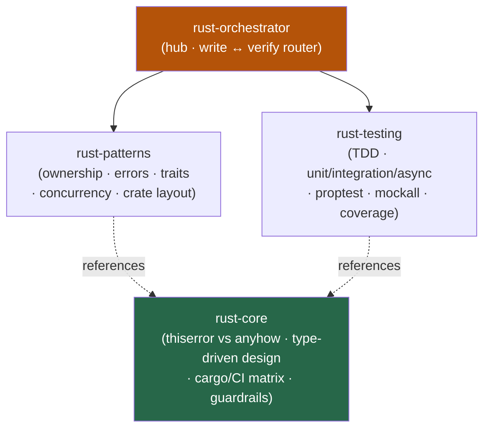

<div align="center">


</div>

<div align="center">

[](../../LICENSE)
[](../../skills.sh.json)
[](https://www.rust-lang.org)
[](https://skills.sh/)

**Idiomatic Rust, behind a single router.**
Writing, reviewing, refactoring, or testing Rust? The orchestrator places your task on the
**write ↔ verify** axis and routes; `rust-core` holds the error strategy both spokes share.

</div>


## What it is

4 skills: `rust-orchestrator` (router) + `rust-core` (shared model) + 2 specialists
(`rust-patterns`, `rust-testing`). The cluster's job is to make Rust work *navigable* — the
orchestrator knows whether you're shaping code or proving it, and the core keeps the one decision
everything hinges on (library `thiserror` vs application `anyhow`) consistent across both spokes.



## Skills

| Concern | Skill | Role |
|---|---|---|
| **Router** | `rust-orchestrator` | Places the task on the write ↔ verify axis and delegates |
| **Shared model** | `rust-core` | The error strategy, type-driven conventions, cargo/CI matrix, guardrails |
| **Write** | `rust-patterns` | Idiomatic ownership, error handling, traits, concurrency, crate structure |
| **Verify** | `rust-testing` | Unit, integration, async, property-based tests, mocking, coverage, TDD |

## The model that ties it together

The cluster turns on **who consumes the error**:

```
Library / reusable crate ──> thiserror  (typed enum — callers & tests MATCH on variants)
Application / binary ───────> anyhow     (dynamic Result + .context() — callers REPORT it)
```

Decide library-vs-application first; it fixes the public API and whether tests assert on typed
variants (`matches!`) or just propagate context. `?` over `unwrap()`, illegal states
unrepresentable, `unsafe` minimal and documented. Full model in
[`rust-core`](../../skills/rust-core/SKILL.md).

## Install

```bash
npx skills add Sheshiyer/skill-clusters@rust-orchestrator -g -y    # entry point
npx skills add Sheshiyer/skill-clusters@rust-testing -g -y         # any spoke
```

## Local development

Part of the [`skill-clusters`](../../README.md) monorepo; the repo is the single source of truth.

```bash
./scripts/link-agents.sh --apply    # symlink ~/.agents/skills → these canonical copies
```
