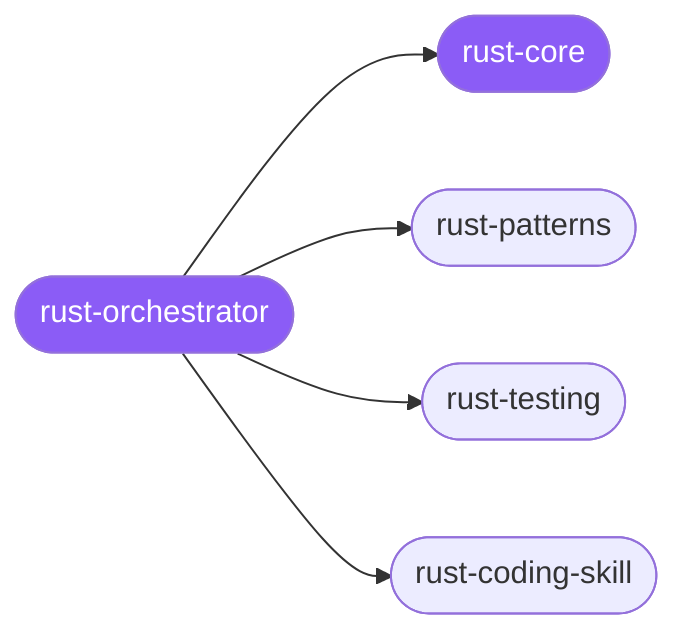

<div align="center">

</div>

<div align="center">

[](../../profiles.json)
[](#skills)
[](../../NOTICE)
[](https://skills.sh/)

</div>

> The single entry skill for Rust work: it locates the task on the **write ↔ verify** axis and delegates to one of two specialists — idiomatic patterns (ownership, errors, traits, concurrency, crate layout) versus testing (unit, integration, async, property-based, mocking, coverage, TDD). The cross-cutting model both spokes share — the library-vs-application error strategy (`thiserror` vs `anyhow`), type-driven design, and the standard cargo toolchain — lives in `rust-core`.

## Hub-and-spoke



## Skills

| Skill | Role | Loaded at startup |
|---|---|---|
| `rust-orchestrator` | 🧭 hub · router | ✅ enumerated |
| `rust-core` | 📐 hub · shared reference | ✅ enumerated |
| `rust-patterns` | spoke | ⤵ on-demand |
| `rust-testing` | spoke | ⤵ on-demand |
| `rust-coding-skill` | spoke | ⤵ on-demand |

## Tier & loading

Enumerated at CLI startup (orchestrator + core); spokes load on demand from `~/.agents/skill-clusters/skills/<name>/SKILL.md`.

## Install

```bash
npx skills add Sheshiyer/skill-clusters@rust-orchestrator -g -y
```

## Attribution

Authored for skill-clusters (MIT). See [../../NOTICE](../../NOTICE).

---
<sub>Part of <a href="../../README.md">skill-clusters</a> — the conductor closed-loop system · <a href="../../docs/CONDUCTOR-INTEGRATION.md">how it's wired</a></sub>
