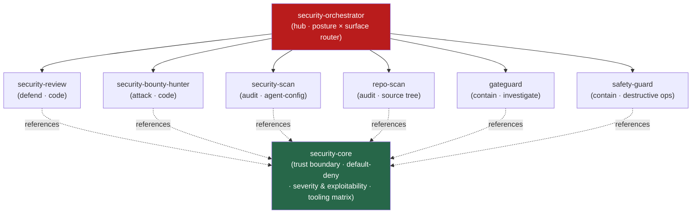

<div align="center">


</div>

<div align="center">

[](../../LICENSE)
[](../../skills.sh.json)
[](../../skills/security-core/SKILL.md)
[](https://skills.sh/)

**Six security specialists behind a single router.**
Securing, auditing, hardening, or attacking a codebase or an agent setup? The orchestrator places
your task on the **posture × surface** map and routes; `security-core` holds the trust-boundary
model they all share.

</div>


## What it is

8 skills: `security-orchestrator` (router) + `security-core` (shared model) + 6 specialist
spokes. The cluster's job is to make security work *navigable* — the orchestrator knows which
of the six to reach for across the *defend vs attack* × *code / agent-config / runtime* matrix,
and the core keeps the one idea they all turn on — the **trust boundary** (untrusted input/action
reaching a privileged sink, contained by default-deny) — consistent.



## Skills by concern

| Concern | Spokes |
|---|---|
| **Router / model** | `security-orchestrator`, `security-core` |
| **Defend — code** | `security-review` |
| **Attack — code** | `security-bounty-hunter` |
| **Audit — agent config** | `security-scan` |
| **Audit — source tree** | `repo-scan` |
| **Contain — runtime** | `gateguard`, `safety-guard` |

## The model that ties it together

Every security question reduces to one thing — **can attacker-controlled input or action reach a
privileged sink, and what contains it?**

```
Untrusted source ──reaches──> Sink (privileged effect) ──contained by──> Control (default-deny)
```

A finding is real only when a reachable path connects an untrusted source to a meaningful sink;
a control is sound only when it grants the narrowest access that works and never widens silently.
Full model in [`security-core`](../../skills/security-core/SKILL.md).

## Install

```bash
npx skills add Sheshiyer/skill-clusters@security-orchestrator -g -y     # entry point
npx skills add Sheshiyer/skill-clusters@security-review -g -y           # any spoke
```

## Local development

Part of the [`skill-clusters`](../../README.md) monorepo; the repo is the single source of truth.

```bash
./scripts/link-agents.sh --apply    # symlink ~/.agents/skills → these canonical copies
```
