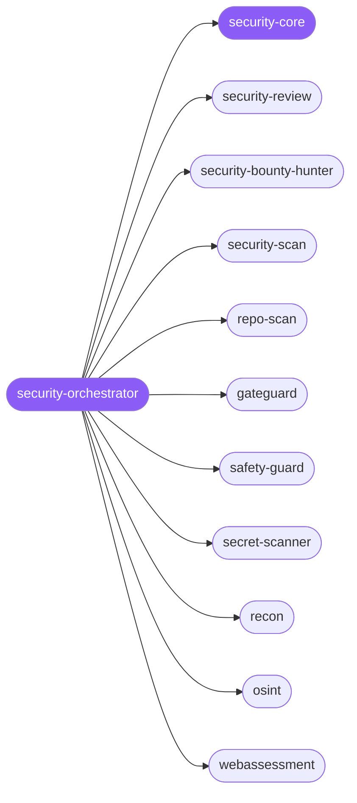

<div align="center">

</div>

<div align="center">

[](../../profiles.json)
[](#skills)
[](../../NOTICE)
[](https://skills.sh/)

</div>

> Routes a security task across the **posture × surface** map — *defend vs attack* against *code, agent-config, source tree, or live runtime* — and delegates to one of thirteen specialists: defensive code review, offensive/bounty vulnerability hunting, agent-config (`.claude`) auditing, source-asset & embedded-dependency scanning, recon/OSINT, web/LLM penetration testing, secret scanning, threat intel, plus a pre-action fact-forcing gate and destructive-operation safety locks. The cross-cutting **trust boundary** — where attacker-controlled input reaches a privileged sink, and the default-deny posture that contains it — lives in `security-core`.

## Hub-and-spoke



_…and 3 more in the table below._

## Skills

| Skill | Role | Loaded at startup |
|---|---|---|
| `security-orchestrator` | 🧭 hub · router | ✅ enumerated |
| `security-core` | 📐 hub · shared reference | ✅ enumerated |
| `security-review` | spoke | ⤵ on-demand |
| `security-scan` | spoke | ⤵ on-demand |
| `security-bounty-hunter` | spoke | ⤵ on-demand |
| `repo-scan` | spoke | ⤵ on-demand |
| `gateguard` | spoke | ⤵ on-demand |
| `safety-guard` | spoke | ⤵ on-demand |
| `secret-scanner` | spoke | ⤵ on-demand |
| `osint` | spoke | ⤵ on-demand |
| `recon` | spoke | ⤵ on-demand |
| `webassessment` | spoke | ⤵ on-demand |
| `promptinjection` | spoke | ⤵ on-demand |
| `annualreports` | spoke | ⤵ on-demand |
| `secupdates` | spoke | ⤵ on-demand |

## Tier & loading

Enumerated at CLI startup (orchestrator + core); spokes load on demand from `~/.agents/skill-clusters/skills/<name>/SKILL.md`.

## Install

```bash
npx skills add Sheshiyer/skill-clusters@security-orchestrator -g -y
```

## Attribution

Authored for skill-clusters (MIT) — the six core spokes (`security-review`, `security-scan`, `security-bounty-hunter`, `repo-scan`, `gateguard`, `safety-guard`). + mixed: folded-in spokes from the PAI/Codex skills library, and `secret-scanner` from lxgic-studios (MIT). See [NOTICE](../../NOTICE).

---
<sub>Part of <a href="../../README.md">skill-clusters</a> — the conductor closed-loop system · <a href="../../docs/CONDUCTOR-INTEGRATION.md">how it's wired</a></sub>
