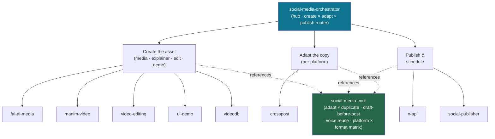

<div align="center">


</div>

<div align="center">

[](../../LICENSE)
[](../../skills.sh.json)
[](../../skills/social-publisher/SKILL.md)
[](https://skills.sh/)

**Create the asset, adapt the copy, publish to the right network — behind a single router.**
Making content or shipping it across X and 12 more platforms? The orchestrator places your task
on the **create → adapt → publish** pipeline and routes; `social-media-core` holds the
adapt-don't-duplicate model and draft-before-post contract they all share.

</div>


## What it is

10 skills: `social-media-orchestrator` (router) + `social-media-core` (shared model) + 8
specialists. The cluster's job is to take a vague "make and post this" and make it *navigable* —
the orchestrator knows which maker, adapter, and publisher to reach for, and the core keeps the
interlocking conventions (adapt-per-platform, draft-before-post, voice reuse, the platform ×
format matrix) consistent so no spoke broadcasts identical copy or posts unreviewed.



## Skills by stage

| Stage | Spokes |
|---|---|
| **Router / model** | `social-media-orchestrator`, `social-media-core` |
| **Create the asset** | `fal-ai-media` (image/video/audio gen), `manim-video` (technical explainers), `video-editing` (cut & structure real footage), `ui-demo` (record product demos), `videodb` (see/understand/clip existing media) |
| **Adapt the copy** | `crosspost` (one idea → native per-platform variants) |
| **Publish & schedule** | `x-api` (direct X/Twitter API), `social-publisher` (13 networks via SocialClaw) |

## The model that ties it together

**Adapt, don't duplicate** — one idea becomes one native version per network:

```
Idea ──> Primary version ──adapt──> per-platform variants   (then: draft → approve → publish)
```

Each variant reads like the same author under a different constraint; publishing is
approval-gated unless the user says "post now"; voice is captured once and reused. Full model in
[`social-media-core`](../../skills/social-media-core/SKILL.md).

## Install

```bash
npx skills add Sheshiyer/skill-clusters@social-media-orchestrator -g -y     # entry point
npx skills add Sheshiyer/skill-clusters@social-publisher -g -y              # any spoke
```

## Local development

Part of the [`skill-clusters`](../../README.md) monorepo; the repo is the single source of truth.

```bash
./scripts/link-agents.sh --apply    # symlink ~/.agents/skills → these canonical copies
```
