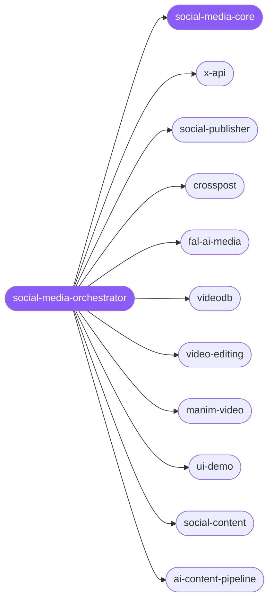

<div align="center">

</div>

<div align="center">

[](../../profiles.json)
[](#skills)
[](../../NOTICE)
[](https://skills.sh/)

</div>

> Routes a social-media task to the right specialist — making the asset (image/video/audio, explainer animation, demo capture, editing, video understanding), adapting copy per platform, and publishing or scheduling across X and 13 networks. It locates the work on the **create → adapt → publish** pipeline and delegates; the shared rules (adapt-don't-duplicate, draft-before-post, voice reuse, the platform × format matrix) live in `social-media-core`.

## Hub-and-spoke



_…and 7 more in the table below._

## Skills

| Skill | Role | Loaded at startup |
|---|---|---|
| `social-media-orchestrator` | 🧭 hub · router | ✅ enumerated |
| `social-media-core` | 📐 hub · shared reference | ✅ enumerated |
| `x-api` | spoke | ⤵ on-demand |
| `social-publisher` | spoke | ⤵ on-demand |
| `crosspost` | spoke | ⤵ on-demand |
| `fal-ai-media` | spoke | ⤵ on-demand |
| `videodb` | spoke | ⤵ on-demand |
| `video-editing` | spoke | ⤵ on-demand |
| `manim-video` | spoke | ⤵ on-demand |
| `ui-demo` | spoke | ⤵ on-demand |
| `social-content` | spoke | ⤵ on-demand |
| `twitter-automation` | spoke | ⤵ on-demand |
| `bird-cli` | spoke | ⤵ on-demand |
| `gram-cli` | spoke | ⤵ on-demand |
| `reddit-cli` | spoke | ⤵ on-demand |
| `discord` | spoke | ⤵ on-demand |
| `social-intake-orchestrator` | spoke | ⤵ on-demand |
| `x-bookmark-opportunity-skill` | spoke | ⤵ on-demand |
| `ai-content-pipeline` | spoke | ⤵ on-demand |

## Tier & loading

Off by default — 0 startup cost. Activate with `node scripts/tier.mjs --activate social-media --apply`.

## Install

```bash
npx skills add Sheshiyer/skill-clusters@social-media-orchestrator -g -y
```

## Attribution

Mixed sources — authored for skill-clusters (MIT), with the asset-maker and publish spokes adapted from [affaan-m/ECC](../../NOTICE) (MIT). See [NOTICE](../../NOTICE) for the per-skill breakdown. + mixed.

---
<sub>Part of <a href="../../README.md">skill-clusters</a> — the conductor closed-loop system · <a href="../../docs/CONDUCTOR-INTEGRATION.md">how it's wired</a></sub>
