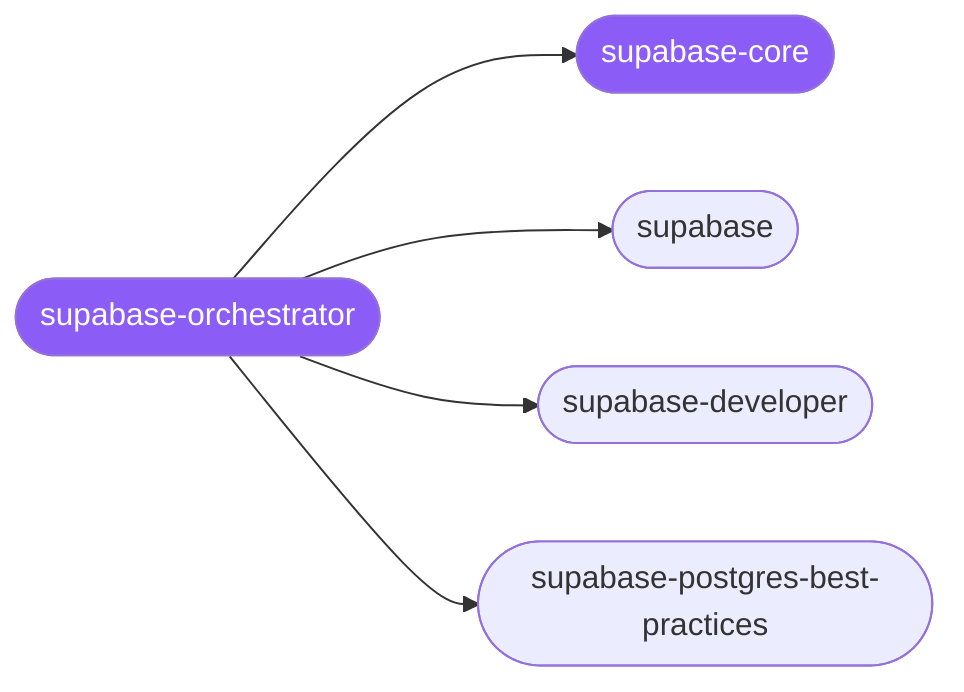

<div align="center">

</div>

<div align="center">

[](../../profiles.json)
[](#skills)
[](../../NOTICE)
[](https://skills.sh/)

</div>

> Routes any Supabase task to one of three specialists by locating it on the **concern × surface** map — full-stack feature build (Auth, Storage, Realtime, Edge Functions, RLS schema), live-doc-verified current-API correctness with the security checklist and CLI/MCP workflow, or Postgres performance and query optimization. The cross-cutting model every Supabase app shares — **authorization lives in Postgres Row-Level Security**, the keys/roles that reach the database, and the schema-change → advisor → migration workflow — lives in `supabase-core`.

## Hub-and-spoke



## Skills

| Skill | Role | Loaded at startup |
|---|---|---|
| `supabase-orchestrator` | 🧭 hub · router | ✅ enumerated |
| `supabase-core` | 📐 hub · shared reference | ✅ enumerated |
| `supabase` | spoke | ⤵ on-demand |
| `supabase-developer` | spoke | ⤵ on-demand |
| `supabase-postgres-best-practices` | spoke | ⤵ on-demand |

## Tier & loading

Enumerated at CLI startup (orchestrator + core); spokes load on demand from `~/.agents/skill-clusters/skills/<name>/SKILL.md`.

## Install

```bash
npx skills add Sheshiyer/skill-clusters@supabase-orchestrator -g -y
```

## Attribution

Authored for skill-clusters (MIT). Spoke content adapts upstream Supabase-published guidance (MIT); see [NOTICE](../../NOTICE).

---
<sub>Part of <a href="../../README.md">skill-clusters</a> — the conductor closed-loop system · <a href="../../docs/CONDUCTOR-INTEGRATION.md">how it's wired</a></sub>
