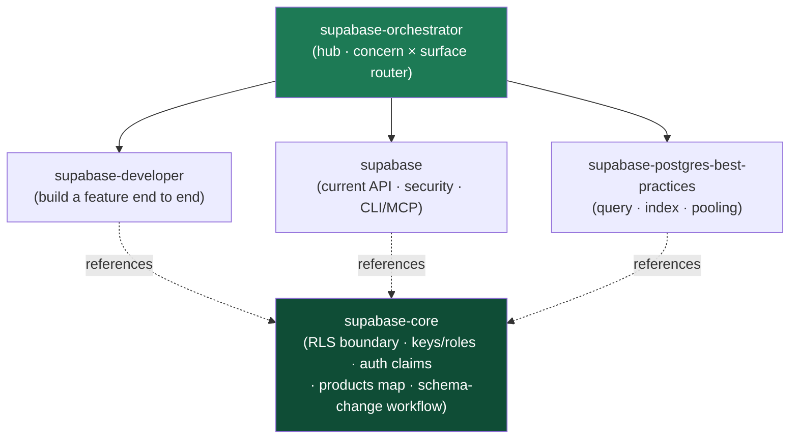

<div align="center">


</div>

<div align="center">

[](../../LICENSE)
[](../../skills.sh.json)
[](https://supabase.com)
[](https://skills.sh/)

**Building on, securing, or tuning Supabase?** The orchestrator places your task on the
**concern × surface** map and routes; `supabase-core` holds the authorization model they all
share — **Row-Level Security is the one boundary every Supabase product enforces.**

</div>


## What it is

5 skills: `supabase-orchestrator` (router) + `supabase-core` (shared model) + 3 specialists.
Supabase exposes your Postgres tables directly, so authorization can't live in an app server —
it lives in the database as RLS. The orchestrator knows which specialist to reach for, and the
core keeps the interlocking security concepts (RLS policies, keys/roles, auth claims, the
schema-change workflow) consistent across all three.



## Skills by concern

| Concern | Spokes |
|---|---|
| **Router / model** | `supabase-orchestrator`, `supabase-core` |
| **Build a feature end to end** | `supabase-developer` — Auth, Storage, Realtime, Edge Functions, RLS schema design, client SDK wiring (Next.js / React / Vue), phase-by-phase implementation |
| **Current API · security · CLI/MCP** | `supabase` — live-doc-verified product guidance, the Supabase-specific security checklist, `getSession`/`getUser`/`getClaims` + `@supabase/ssr`, CLI & MCP-server workflow, advisors → migration |
| **Database performance** | `supabase-postgres-best-practices` — query optimization, missing/partial indexes, query-plan review, connection pooling & scaling, concurrency/locking, monitoring |

## The model that ties it together

Supabase serves your tables directly, so **authorization lives in Postgres as Row-Level Security**:

```
Request ──carries──> Role + JWT claims ──checked by──> RLS Policy(ies) ──on──> Table/Storage object
```

Enable RLS on every table in an exposed schema; write policies that match the real access model;
`UPDATE` needs a `SELECT` policy; use `app_metadata` (never user-editable `user_metadata`) for
auth decisions; never ship the `service_role` key to a public client. Full model in
[`supabase-core`](../../skills/supabase-core/SKILL.md).

## Install

```bash
npx skills add Sheshiyer/skill-clusters@supabase-orchestrator -g -y     # entry point
npx skills add Sheshiyer/skill-clusters@supabase-developer -g -y        # any spoke
```

## Local development

Part of the [`skill-clusters`](../../README.md) monorepo; the repo is the single source of truth.

```bash
./scripts/link-agents.sh --apply    # symlink ~/.agents/skills → these canonical copies
```
