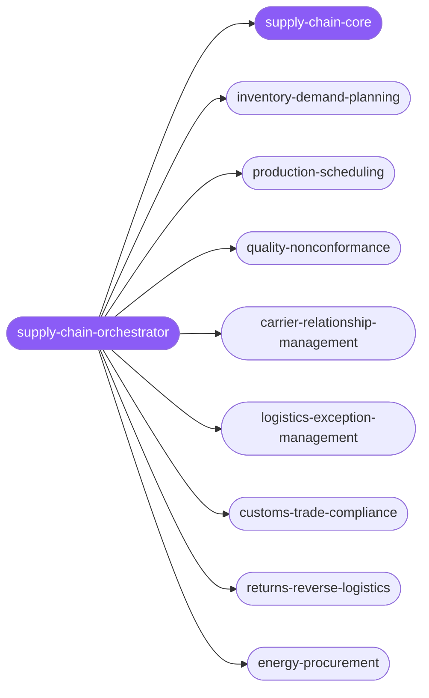

<div align="center">

</div>

<div align="center">

[](../../profiles.json)
[](#skills)
[](../../NOTICE)
[](https://skills.sh/)

</div>

> Routes a supply-chain task along the SCOR backbone (Plan → Source → Make → Deliver → Return) to one of 8 specialists — demand & inventory planning, production scheduling, quality/non-conformance, carrier relationships, logistics exceptions, customs & trade compliance, returns/reverse logistics, and energy procurement. Every spoke optimizes the **same objective with different levers**: protect the customer promise (OTIF / fill rate) at the lowest total landed cost under a binding constraint.

## Hub-and-spoke



## Skills

| Skill | Role | Loaded at startup |
|---|---|---|
| `supply-chain-orchestrator` | 🧭 hub · router | ✅ enumerated |
| `supply-chain-core` | 📐 hub · shared reference | ✅ enumerated |
| `inventory-demand-planning` | spoke | ⤵ on-demand |
| `production-scheduling` | spoke | ⤵ on-demand |
| `quality-nonconformance` | spoke | ⤵ on-demand |
| `carrier-relationship-management` | spoke | ⤵ on-demand |
| `logistics-exception-management` | spoke | ⤵ on-demand |
| `customs-trade-compliance` | spoke | ⤵ on-demand |
| `returns-reverse-logistics` | spoke | ⤵ on-demand |
| `energy-procurement` | spoke | ⤵ on-demand |

## Tier & loading

Off by default — 0 startup cost. Activate with `node scripts/tier.mjs --activate supply-chain --apply`.

## Install

```bash
npx skills add Sheshiyer/skill-clusters@supply-chain-orchestrator -g -y
```

## Attribution

Adapted from [affaan-m/ECC](../../NOTICE) (MIT). All 8 spokes in this cluster originate from ECC.

---
<sub>Part of <a href="../../README.md">skill-clusters</a> — the conductor closed-loop system · <a href="../../docs/CONDUCTOR-INTEGRATION.md">how it's wired</a></sub>
