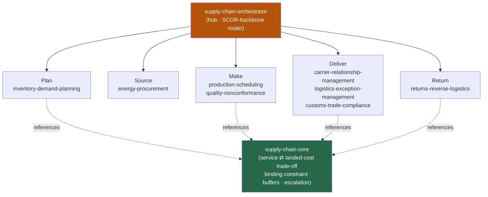

<div align="center">


</div>

<div align="center">

[](../../LICENSE)
[](../../skills.sh.json)
[](https://www.ascm.org/corporate-solutions/standards-tools/scor/)
[](https://skills.sh/)

**Operational supply-chain expertise — 8 domain specialists behind a single router.**
Planning, making, moving, clearing, or returning goods? The orchestrator places your task on the
**SCOR backbone (Plan → Source → Make → Deliver → Return)** and routes; `supply-chain-core` holds
the service-vs-landed-cost trade-off they all optimize.

</div>


## What it is

10 skills: `supply-chain-orchestrator` (router) + `supply-chain-core` (shared model) + 8
function specialists drawn from decades of operator experience. The cluster's job is to make a
broad operational domain *navigable* — the orchestrator knows which of the 8 to reach for, and
the core keeps the interlocking ideas (the service/landed-cost trade-off, buffers, the binding
constraint, escalation thresholds) consistent so no spoke contradicts another.



## Skills by SCOR stage

| Stage | Spokes |
|---|---|
| **Router / model** | `supply-chain-orchestrator`, `supply-chain-core` |
| **Plan** | `inventory-demand-planning` |
| **Source** | `energy-procurement` |
| **Make** | `production-scheduling`, `quality-nonconformance` |
| **Deliver** | `carrier-relationship-management`, `logistics-exception-management`, `customs-trade-compliance` |
| **Return** | `returns-reverse-logistics` |

## The model that ties it together

Every function optimizes the **same objective**:

```
maximize Service (OTIF / fill rate)   minimize Total landed cost
   subject to the stage's binding constraint   buffered by deliberate slack
```

Protect the customer promise at the lowest total landed cost; name the binding constraint before
optimizing; price every buffer; honor compliance/safety hard stops. Full model in
[`supply-chain-core`](../../skills/supply-chain-core/SKILL.md).

## Install

```bash
npx skills add Sheshiyer/skill-clusters@supply-chain-orchestrator -g -y     # entry point
npx skills add Sheshiyer/skill-clusters@inventory-demand-planning -g -y     # any spoke
```

## Local development

Part of the [`skill-clusters`](../../README.md) monorepo; the repo is the single source of truth.

```bash
./scripts/link-agents.sh --apply    # symlink ~/.agents/skills → these canonical copies
```
