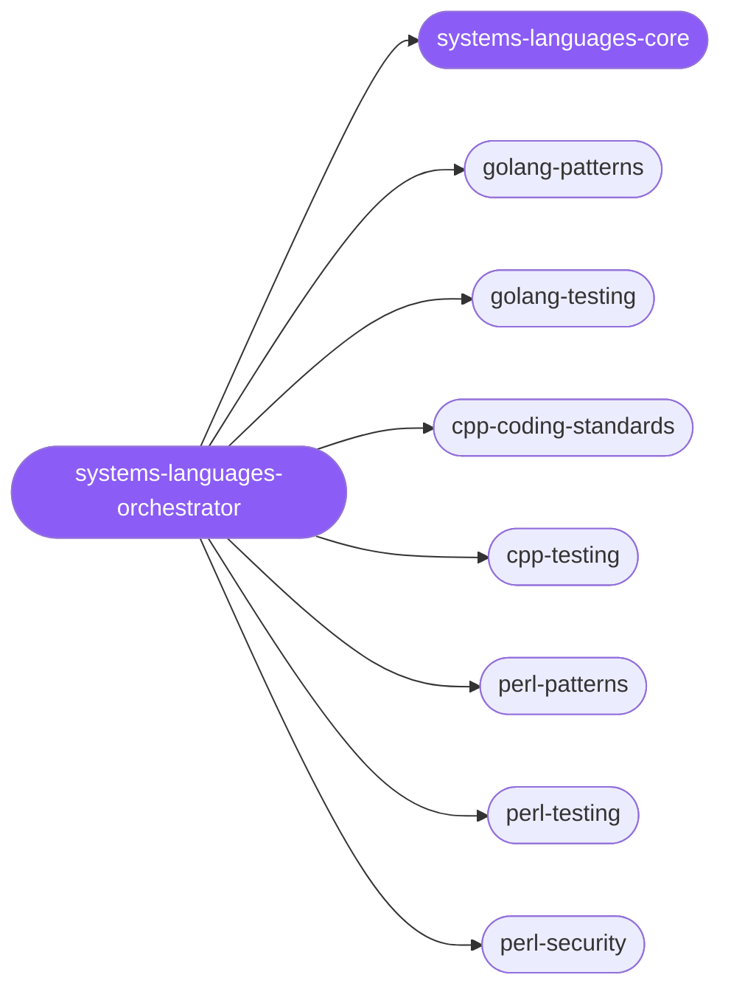

<div align="center">

</div>

<div align="center">

[](../../profiles.json)
[](#skills)
[](../../NOTICE)
[](https://skills.sh/)

</div>

> Routes a systems-language task to the right specialist among Go, C++, and Perl by locating it on the **language × concern** map, then walks the shared **write → prove → harden** lifecycle: pick the language, apply its idiomatic conventions, drive it test-first, and (for Perl) harden against untrusted input.

## Hub-and-spoke



## Skills

| Skill | Role | Loaded at startup |
|---|---|---|
| `systems-languages-orchestrator` | 🧭 hub · router | ✅ enumerated |
| `systems-languages-core` | 📐 hub · shared reference | ✅ enumerated |
| `golang-patterns` | spoke | ⤵ on-demand |
| `golang-testing` | spoke | ⤵ on-demand |
| `cpp-coding-standards` | spoke | ⤵ on-demand |
| `cpp-testing` | spoke | ⤵ on-demand |
| `perl-patterns` | spoke | ⤵ on-demand |
| `perl-testing` | spoke | ⤵ on-demand |
| `perl-security` | spoke | ⤵ on-demand |

## Tier & loading

Off by default — 0 startup cost. Activate with `node scripts/tier.mjs --activate systems-languages --apply`.

## Install

```bash
npx skills add Sheshiyer/skill-clusters@systems-languages-orchestrator -g -y
```

## Attribution

Spokes adapted from [affaan-m/ECC](../../NOTICE) (MIT). See [NOTICE](../../NOTICE) for full attribution.

---
<sub>Part of <a href="../../README.md">skill-clusters</a> — the conductor closed-loop system · <a href="../../docs/CONDUCTOR-INTEGRATION.md">how it's wired</a></sub>
