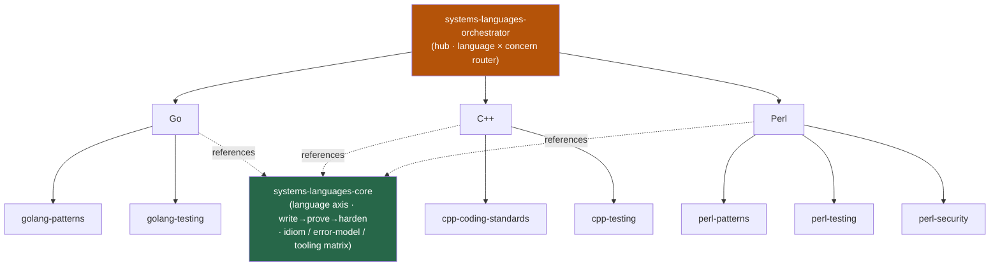

<div align="center">


</div>

<div align="center">

[](../../LICENSE)
[](../../skills.sh.json)
[](https://go.dev)
[](https://isocpp.github.io/CppCoreGuidelines/CppCoreGuidelines)
[](https://www.perl.org)
[](https://skills.sh/)

**7 Go, C++ & Perl specialists behind a single router.**
Writing, reviewing, testing, or hardening systems code? The orchestrator places your task on the
**language × concern** map and routes; `systems-languages-core` holds the language-axis decision
and the write → prove → harden lifecycle they all share.

</div>


## What it is

9 skills: `systems-languages-orchestrator` (router) + `systems-languages-core` (shared model) +
7 specialists across Go, C++, and Perl. The cluster's job is to make a multi-language skill set
*navigable* — the orchestrator knows which spoke to reach for given your language and concern, and
the core keeps the decision (which language → which idiom, error model, and toolchain) and the
patterns → testing → (Perl) security lifecycle consistent.



## Skills by concern

| Concern | Spokes |
|---|---|
| **Router / model** | `systems-languages-orchestrator`, `systems-languages-core` |
| **Go** | `golang-patterns`, `golang-testing` |
| **C++** | `cpp-coding-standards`, `cpp-testing` |
| **Perl** | `perl-patterns`, `perl-testing`, `perl-security` |

## The model that ties it together

There is no framework choice here — each spoke is one language. The single decision is **which
language**, which fixes the idiom, error model, and toolchain; from there every task walks the
same lifecycle:

```
Language (Go · C++ · Perl) ──> write ──> prove ──> harden
                          (patterns/    (testing   (Perl: security)
                           standards)    spoke)
```

One language per task — crossing idioms (Go errors vs C++ exceptions vs Perl taint) is the main
failure mode. Full decision, lifecycle, and the per-language tooling matrix in
[`systems-languages-core`](../../skills/systems-languages-core/SKILL.md).

## Install

```bash
npx skills add Sheshiyer/skill-clusters@systems-languages-orchestrator -g -y     # entry point
npx skills add Sheshiyer/skill-clusters@perl-security -g -y                       # any spoke
```

## Local development

Part of the [`skill-clusters`](../../README.md) monorepo; the repo is the single source of truth.

```bash
./scripts/link-agents.sh --apply    # symlink ~/.agents/skills → these canonical copies
```
