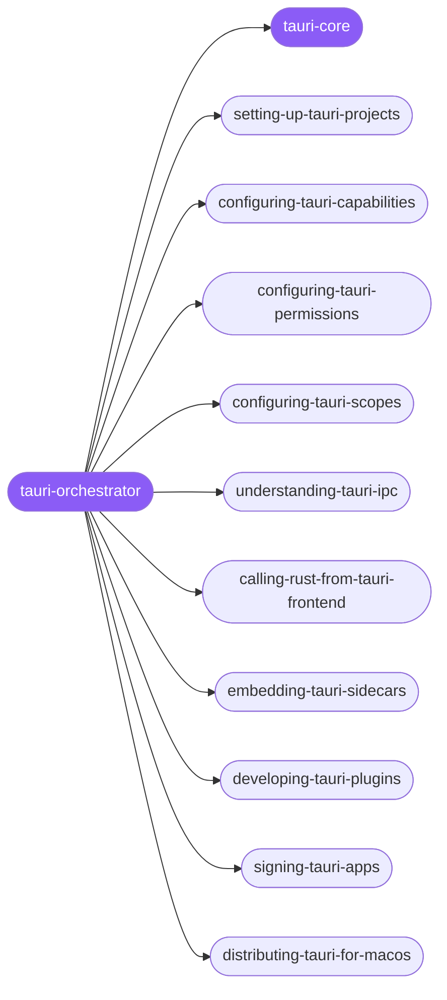

<div align="center">

</div>

<div align="center">

[](../../profiles.json)
[](#skills)
[](../../NOTICE)
[](https://skills.sh/)

</div>

> Routes any Tauri v2 desktop/mobile task across 40 specialists on the **lifecycle × concern** map — scaffolding, the capability/permission/scope security model, the IPC trust boundary and Rust↔frontend bridge, windows, sidecars, plugins, building, signing, and per-platform distribution. The interlocking model every Tauri app shares lives in `tauri-core`: read it before configuring permissions, wiring IPC, or planning a release.

## Hub-and-spoke



_…and 30 more in the table below._

## Skills

| Skill | Role | Loaded at startup |
|---|---|---|
| `tauri-orchestrator` | 🧭 hub · router | ✅ enumerated |
| `tauri-core` | 📐 hub · shared reference | ✅ enumerated |
| `adding-tauri-splashscreen` | spoke | ⤵ on-demand |
| `adding-tauri-system-tray` | spoke | ⤵ on-demand |
| `building-tauri-with-github-actions` | spoke | ⤵ on-demand |
| `calling-frontend-from-tauri-rust` | spoke | ⤵ on-demand |
| `calling-rust-from-tauri-frontend` | spoke | ⤵ on-demand |
| `configuring-tauri-apps` | spoke | ⤵ on-demand |
| `configuring-tauri-capabilities` | spoke | ⤵ on-demand |
| `configuring-tauri-csp` | spoke | ⤵ on-demand |
| `configuring-tauri-http-headers` | spoke | ⤵ on-demand |
| `configuring-tauri-permissions` | spoke | ⤵ on-demand |
| `configuring-tauri-scopes` | spoke | ⤵ on-demand |
| `customizing-tauri-windows` | spoke | ⤵ on-demand |
| `debugging-tauri-apps` | spoke | ⤵ on-demand |
| `developing-tauri-plugins` | spoke | ⤵ on-demand |
| `distributing-tauri-for-android` | spoke | ⤵ on-demand |
| `distributing-tauri-for-ios` | spoke | ⤵ on-demand |
| `distributing-tauri-for-macos` | spoke | ⤵ on-demand |
| `distributing-tauri-for-windows` | spoke | ⤵ on-demand |
| `embedding-tauri-sidecars` | spoke | ⤵ on-demand |
| `integrating-tauri-js-frontends` | spoke | ⤵ on-demand |
| `integrating-tauri-rust-frontends` | spoke | ⤵ on-demand |
| `listening-to-tauri-events` | spoke | ⤵ on-demand |
| `managing-tauri-app-resources` | spoke | ⤵ on-demand |
| `managing-tauri-plugin-permissions` | spoke | ⤵ on-demand |
| `migrating-tauri-apps` | spoke | ⤵ on-demand |
| `optimizing-tauri-binary-size` | spoke | ⤵ on-demand |
| `packaging-tauri-for-linux` | spoke | ⤵ on-demand |
| `running-nodejs-sidecar-in-tauri` | spoke | ⤵ on-demand |
| `setting-up-tauri-projects` | spoke | ⤵ on-demand |
| `signing-tauri-apps` | spoke | ⤵ on-demand |
| `tauri-v2` | spoke | ⤵ on-demand |
| `testing-tauri-apps` | spoke | ⤵ on-demand |
| `understanding-tauri-architecture` | spoke | ⤵ on-demand |
| `understanding-tauri-ecosystem-security` | spoke | ⤵ on-demand |
| `understanding-tauri-ipc` | spoke | ⤵ on-demand |
| `understanding-tauri-lifecycle-security` | spoke | ⤵ on-demand |
| `understanding-tauri-process-model` | spoke | ⤵ on-demand |
| `understanding-tauri-runtime-authority` | spoke | ⤵ on-demand |
| `updating-tauri-dependencies` | spoke | ⤵ on-demand |
| `using-crabnebula-cloud-with-tauri` | spoke | ⤵ on-demand |

## Tier & loading

Enumerated at CLI startup (orchestrator + core); spokes load on demand from `~/.agents/skill-clusters/skills/<name>/SKILL.md`.

## Install

```bash
npx skills add Sheshiyer/skill-clusters@tauri-orchestrator -g -y
```

## Attribution

Authored for skill-clusters (MIT). See [NOTICE](../../NOTICE).

---
<sub>Part of <a href="../../README.md">skill-clusters</a> — the conductor closed-loop system · <a href="../../docs/CONDUCTOR-INTEGRATION.md">how it's wired</a></sub>
