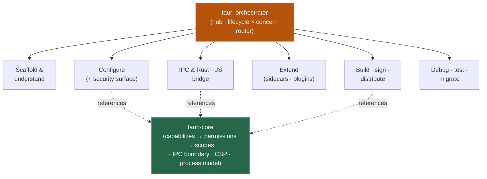

<div align="center">


</div>

<div align="center">

[](../../LICENSE)
[](../../skills.sh.json)
[](https://tauri.app)
[](https://skills.sh/)

**The flagship cluster — 40 Tauri v2 specialists behind a single router.**
Building, securing, bridging, or shipping a Tauri app? The orchestrator places your task on
the **lifecycle × concern** map and routes; `tauri-core` holds the security model they all share.

</div>


## What it is

42 skills: `tauri-orchestrator` (router) + `tauri-core` (shared model) + 40 existing
specialists. The cluster's job is to make a huge, deep skill set *navigable* — the
orchestrator knows which of the 40 to reach for, and the core keeps the interlocking
security concepts (capabilities → permissions → scopes, IPC, CSP, process model) consistent.



## Skills by concern

| Concern | Spokes |
|---|---|
| **Router / model** | `tauri-orchestrator`, `tauri-core` |
| **Scaffold & understand** | `setting-up-tauri-projects`, `tauri-v2`, `understanding-tauri-architecture`, `understanding-tauri-process-model`, `understanding-tauri-runtime-authority`, `understanding-tauri-lifecycle-security`, `understanding-tauri-ecosystem-security` |
| **Configure** | `configuring-tauri-apps`, `configuring-tauri-capabilities`, `configuring-tauri-permissions`, `configuring-tauri-scopes`, `configuring-tauri-csp`, `configuring-tauri-http-headers`, `customizing-tauri-windows`, `adding-tauri-splashscreen`, `adding-tauri-system-tray`, `managing-tauri-app-resources` |
| **IPC & bridge** | `understanding-tauri-ipc`, `calling-rust-from-tauri-frontend`, `calling-frontend-from-tauri-rust`, `listening-to-tauri-events`, `integrating-tauri-js-frontends`, `integrating-tauri-rust-frontends` |
| **Extend** | `embedding-tauri-sidecars`, `running-nodejs-sidecar-in-tauri`, `developing-tauri-plugins`, `managing-tauri-plugin-permissions` |
| **Build · sign · ship** | `optimizing-tauri-binary-size`, `building-tauri-with-github-actions`, `signing-tauri-apps`, `distributing-tauri-for-macos`, `distributing-tauri-for-windows`, `packaging-tauri-for-linux`, `distributing-tauri-for-ios`, `distributing-tauri-for-android`, `using-crabnebula-cloud-with-tauri` |
| **Operate** | `debugging-tauri-apps`, `testing-tauri-apps`, `updating-tauri-dependencies`, `migrating-tauri-apps` |

## The model that ties it together

Access is **default-deny**:

```
Window ──has──> Capability ──includes──> Permission(s) ──constrained by──> Scope(s)
```

Grant the narrowest capability that works; the frontend is untrusted, Rust is the trusted core,
and everything crosses one IPC boundary. Full model in
[`tauri-core`](../../skills/tauri-core/SKILL.md).

## Install

```bash
npx skills add Sheshiyer/skill-clusters@tauri-orchestrator -g -y     # entry point
npx skills add Sheshiyer/skill-clusters@distributing-tauri-for-macos -g -y  # any spoke
```

## Local development

Part of the [`skill-clusters`](../../README.md) monorepo; the repo is the single source of truth.

```bash
./scripts/link-agents.sh --apply    # symlink ~/.agents/skills → these canonical copies
```
