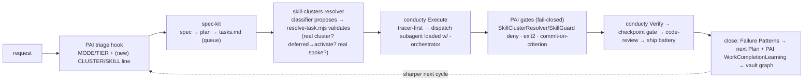

# Conductor Integration — closing the loop across PAI · spec-kit · conducty · skill-clusters

The skill-clusters system is **one wing** of a closed-loop agentic engine. This doc is the
integration contract: who owns what, the seams between them, and the phased build.

## The four organs (researched, grounded in the real repos)

| Organ | Repo | Owns | Key mechanism |
|---|---|---|---|
| **Triage + gates** | PAI (`~/.claude`, v4.0.3) | *when* / *how much* / *enforce* | `CLAUDE.md` mode (MINIMAL/NATIVE/ALGORITHM) + Algorithm v3.7.0; hooks enforce (deny / `exit 2` / inject). **No `capabilities.md` yet → cluster/skill triage is the gap.** |
| **Spec (structure of *what*)** | spec-kit (installed) | the work | `/specify→/plan→/tasks`. `tasks.md` = machine-parseable queue (`- [ ] T## [P] [US#] desc + path`). **Emits no skill binding.** |
| **Conductor (the loop)** | conducty (to install) | *orchestrate + close* | Shape→Plan→Trace→Execute→Verify→Improve→Review→Ship; tracer-first; 3-strike circuit-breaker; leverage-point debug (plan>prompt>code); **Failure Patterns → next Plan**; vault + 12-tool MCP for durable state. **Dispatches to `general-purpose` — no cluster routing.** |
| **Capability wing (resolve)** | **skill-clusters (this repo)** | *which cluster / which skill* | `skill-index.json` (skill→cluster/tier/status) + `SkillClusterResolver` hook + hub orchestrators. **The resolver none of the other three has.** |

## The canonical loop (decided)

**conducty conducts**; PAI triages + enforces fail-closed gates *around* it; spec-kit fronts it
(Shape/Plan); skill-clusters resolves capability per task.

## The seams (the integration contracts)

1. **PAI triage → spec-kit.** PAI mode = ALGORITHM + a build intent ⇒ route to the spec-kit/conducty path. (Today: manual. Phase 3 adds a classifier line `CLUSTER: <x> | SKILL: <y>`.)
2. **spec-kit → resolver.** `tasks.md` checkbox grammar is the queue (90% machine-parseable: id, `[P]`, `[US#]`, paths, `[x]`). `plan.md` Technical Context is the routing stack. **No skill field — by design.**
3. **resolver → conducty (THE missing organ — built).** `scripts/resolve-task.mjs <tasks.md> [plan.md]` → per-task `{cluster, dispatch: <cluster>-orchestrator, tier, activate?, spokes[], confidence}` + `touched`, `activate`, `unresolved`. **v1 = deterministic keyword scoring (noisy, proven on real snow-gloves tasks). v2 = classifier proposes cluster/skill, resolve-task VALIDATES** (phantom-proof against the index; deferred→activate; low-confidence→human escalation — mirrors PAI's Capability-Name audit).
4. **conducty Execute → dispatch.** Replace conducty's hard-coded `subagent_type: general-purpose` with the resolved `<cluster>-orchestrator` (loaded into the subagent); the hub routes to the spoke (on-demand from the pointer). Deferred clusters are `tier.mjs --activate`-ed first.
5. **PAI gates enforce conducty's instructions.** conducty *instructs* verification; PAI hooks *enforce* it: `SkillClusterResolver` already denies non-enumerated skills with resolution guidance; add a `commit-on-criterion` (PostToolUse on `[ ]→[x]`) and flip fail-open `exit(0)` → fail-closed `exit(2)` for true gates.
6. **close the loop.** conducty's `Failure Patterns → next Plan` + MCP `record_checkpoint/record_improvement/create_ship_report` is the durable close; pair with PAI `WorkCompletionLearning`. The skill-clusters `skills-health` + (future) runtime-health feed cluster quality back.

## Build phases

- **✅ Phase 0 — resolver tracer.** `scripts/resolve-task.mjs` built + proven on real snow-gloves `tasks.md`. Emits dispatch plans, flags deferred-to-activate + unresolved. *(Honest result: keyword v1 is noisy → confirms classifier-proposes + resolver-validates is the right design.)*
- **Phase 1 — install conducty** (`git clone … && install-claude-code.sh`, or vendor its loop skills + MCP server into the system) as the canonical conductor.
- **Phase 2 — wire Execute → resolver.** Patch `conducty-execute`'s dispatch to call `resolve-task.mjs` and load the resolved `<cluster>-orchestrator`; auto-`activate` deferred clusters per wave.
- **Phase 3 — the classifier line.** Add a PAI hook (or extend the Algorithm OBSERVE phase) emitting `CLUSTER/SKILL`; `resolve-task` validates it; this replaces noisy keyword-only picking.
- **Phase 4 — fail-closed gates.** `commit-on-criterion` hook; flip gate hooks to `exit(2)`; the ship battery (lint/typecheck/tests/secrets/vuln) as enforced, not advisory.
- **Phase 5 — close the feedback.** conducty Failure-Patterns + MCP state ↔ PAI learning ↔ skill-cluster health; the vault graph is the shared memory the next cycle reads.

## Decisions on file
Canonical conductor = **conducty**. Triage = **classifier proposes + resolver validates**. Deliverable
= **full working integration** (built tracer-first across the phases above).
