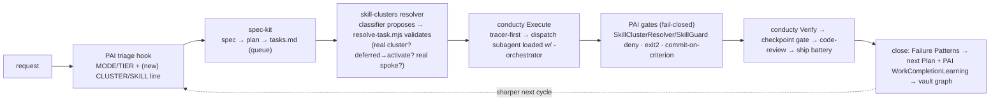

# Conductor Integration — closing the loop across PAI · spec-kit · conducty · skill-clusters

The skill-clusters system is **one wing** of a closed-loop agentic engine. This doc is the
integration contract: who owns what, the seams between them, and the phased build.

## The four organs (researched, grounded in the real repos)

| Organ | Repo | Owns | Key mechanism |
|---|---|---|---|
| **Triage + gates** | PAI (`~/.claude`, v4.0.3) | *when* / *how much* / *enforce* | `CLAUDE.md` mode (MINIMAL/NATIVE/ALGORITHM) + Algorithm v3.7.0; hooks enforce (deny / `exit 2` / inject). **No `capabilities.md` yet → cluster/skill triage is the gap.** |
| **Spec (structure of *what*)** | spec-kit (installed) | the work | `/specify→/plan→/tasks`. `tasks.md` = machine-parseable queue (`- [ ] T## [P] [US#] desc + path`). **Emits no skill binding.** |
| **Conductor (the loop)** | conducty (to install) | *orchestrate + close* | Shape→Plan→Trace→Execute→Verify→Improve→Review→Ship; tracer-first; 3-strike circuit-breaker; leverage-point debug (plan>prompt>code); **Failure Patterns → next Plan**; vault + 12-tool MCP for durable state. **Dispatches to `general-purpose` — no cluster routing.** |
| **Capability wing (resolve)** | **skill-clusters (this repo)** | *which cluster / which skill* | `skill-index.json` (skill→cluster/tier/status) + `SkillClusterResolver` hook + hub orchestrators. **The resolver none of the other three has.** |

## The canonical loop (decided)

**conducty conducts**; PAI triages + enforces fail-closed gates *around* it; spec-kit fronts it
(Shape/Plan); skill-clusters resolves capability per task.

## The seams (the integration contracts)

1. **PAI triage → spec-kit.** PAI mode = ALGORITHM + a build intent ⇒ route to the spec-kit/conducty path. (Today: manual. Phase 3 adds a classifier line `CLUSTER: <x> | SKILL: <y>`.)
2. **spec-kit → resolver.** `tasks.md` checkbox grammar is the queue (90% machine-parseable: id, `[P]`, `[US#]`, paths, `[x]`). `plan.md` Technical Context is the routing stack. **No skill field — by design.**
3. **resolver → conducty (THE missing organ — built).** `scripts/resolve-task.mjs <tasks.md> [plan.md]` → per-task `{cluster, dispatch: <cluster>-orchestrator, tier, activate?, spokes[], confidence}` + `touched`, `activate`, `unresolved`. **v1.5 = deterministic keyword scoring — IDF · sqrt-damped cluster mass · explicit handle-match · unique tokens (5/5 on the mixed smoke, up from 1/5). Next = classifier proposes cluster/skill, resolve-task VALIDATES** (phantom-proof against the index; deferred→activate; low-confidence→human escalation — mirrors PAI's Capability-Name audit).
4. **conducty Execute → dispatch.** Replace conducty's hard-coded `subagent_type: general-purpose` with the resolved `<cluster>-orchestrator` (loaded into the subagent); the hub routes to the spoke (on-demand from the pointer). Deferred clusters are `tier.mjs --activate`-ed first.
5. **PAI gates enforce conducty's instructions.** conducty *instructs* verification; PAI hooks *enforce* it: `SkillClusterResolver` already denies non-enumerated skills with resolution guidance; add a `commit-on-criterion` (PostToolUse on `[ ]→[x]`) and flip fail-open `exit(0)` → fail-closed `exit(2)` for true gates.
6. **close the loop.** conducty's `Failure Patterns → next Plan` + MCP `record_checkpoint/record_improvement/create_ship_report` is the durable close; pair with PAI `WorkCompletionLearning`. The skill-clusters `skills-health` + (future) runtime-health feed cluster quality back.

## Build phases

- **✅ Phase 0 — resolver tracer.** `scripts/resolve-task.mjs` built + proven on real snow-gloves `tasks.md`. Emits dispatch plans, flags deferred-to-activate + unresolved. *(Phase 0 honest result: keyword v1 was noisy. Phase 2 hardened it to v1.5 — see below — solidifying the keyword floor; the classifier still owns genuinely ambiguous stack-vs-domain.)*
- **✅ Phase 1 — vendor conducty** as the `conductor` cluster (MIT). 19 `conducty-*` loop skills as on-demand spokes + authored `conductor-orchestrator`/`conductor-core` (the integration glue). Only the 2 hubs enumerate at startup; debloat invariant holds. Health PASS 0/0. *(Vendored, not installer-run, to avoid bloating `~/.claude` + editing CLAUDE.md.)*
- **✅ Phase 2 — wire Execute → resolver.** `conducty-execute` patched with a **Resolve before dispatch** step: calls `resolve-task.mjs`, loads the resolved `<cluster>-orchestrator` into the subagent (curation item 1.5), `tier.mjs --activate`s deferred clusters per wave, and fails closed via the `SkillClusterResolver` hook. Resolver scoring hardened **v1→v1.5** (IDF · sqrt-dampen cluster mass · explicit handle-match · unique tokens): **5/5 on a mixed RN/Rust/Flutter/Remotion/Supabase smoke** (was 1/5 — all collapsed to `frontend-web`), with `mobile-flutter` correctly flagged deferred→activate.
- **✅ Phase 3 — the classifier line.** `resolve-task.mjs --propose <file.json|id=cluster,...>` built. The classifier is the **conductor LLM itself** (no new PAI hook, no `~/.claude` bloat): it proposes a cluster/skill per task; the resolver **VALIDATES** against the index — accepts real proposals (overriding the keyword guess, `source:classifier` / `◇!` / `overrode`), and **rejects phantoms** (`phantoms` + `badSkills`, keeping the keyword result) exactly like PAI's Capability-Name audit. Smoke-passed every path: agree · override · phantom-reject · bad-skill. The existing `SkillClusterResolver` PAI hook stays as runtime enforcement.
- **✅ Phase 4 — fail-closed gates.** `scripts/ship-battery.mjs` built: a project-generic, **fail-closed** ship gate (structural=skills-health · secrets · lint · typecheck · tests, + advisory secrets-heuristic & gitclean) that **exits non-zero on any required failure** → do not ship, escalate. Proven both ways: planted AWS key → HOLD(secrets) exit 1; this repo (2528 files) → SHIP exit 0 with example-doc passwords correctly downgraded to advisory. Wired into `conductor-orchestrator`'s Ship row + `conductor-core` guardrails. *(commit-on-criterion is satisfied by conducty's existing atomic-commit checkpoint discipline; the live-PAI `exit(0)→exit(2)` flip is offered as an opt-in — see below — not auto-applied, to avoid disrupting the daily driver.)*
- **✅ Phase 5 — close the feedback.** `scripts/loop-feedback.mjs` built: records each cycle (clusters dispatched · deferred activated · escalations · overrides/phantoms/bad-skills · ship verdict) to `feedback/loop-log.jsonl`, and `--rollup` aggregates it into the signal the next Plan reads — *promote hot deferred clusters · retune high-override resolutions · author clusters the classifier keeps phantom-proposing · harden gates that keep failing.* Full closed-loop smoke passed: resolve→ship→record→rollup over 2 cycles surfaced `mobile-flutter` as a promote-candidate and `secrets` as a weak point. This is the capability-wing close, complementing conducty's vault (narrative) and PAI's learning (user-pattern).

## Delivery modalities — local vs GitHub multi-agent (wired)

The conductor runs Execute in one of two modalities; `resolve-task --modality <local|github-delivery>`
validates the conductor's proposal (work-shape signals + orchestrator availability). The per-task
**cluster** is identical across modalities — modality decides **who** runs each task, the cluster **with what**.

| Phase | local (built) | github-delivery (the user's two orchestrators, kept in place) |
|---|---|---|
| Plan | conducty-plan | **swarm-architect** (in `ai-agents-meta`) — phase→wave→swarm, ~80 tasks, `copilot_eligible` |
| Execute | conducty-execute (loaded subagents) | **github-next-wave-orchestrator** (in `git-pr-ops`) — `human` / `copilot-swe-agent[bot]` lanes |
| Gate | `ship-battery.mjs` | swarm verification-gates / next-wave review + `ship-battery.mjs` |
| Close | `loop-feedback.mjs` + vault | swarm OpenViking memory + `loop-feedback.mjs` (records modality + lane split) |

Both are the user's own MIT skills; their full runbooks/playbooks/schemas live in the source repos
(`thoughtseed/{swarm-architect-skill,github-next-wave-orchestrator}/`), the skill-clusters copies are
condensed on-demand versions. Wired via: `resolve-task` modality detection + per-task lane hint (👤/🤖);
`loop-feedback` modality/lane capture; cross-refs in `conductor-core` §4, `conductor-orchestrator`, and
both spoke copies. **Smoke:** a GitHub-delivery plan auto-detected (16 signals), routed
swarm-architect→github-next-wave, split 3 human / 2 copilot lanes, each task still cluster-resolved;
`--modality` proposal validates (disagree→flag) and rejects phantom modalities.

## Live-PAI opt-ins (documented switches, NOT auto-applied)
To keep the daily driver stable, two enforcement upgrades are left as explicit switches the user
throws, not silent edits to `~/.claude`:
1. **Flip `SkillClusterResolver` / gate hooks fail-open `exit(0)` → fail-closed `exit(2)`** — turns
   "deny with guidance" into a hard block. Reversible per-hook.
2. **`commit-on-criterion` PostToolUse hook** (commit on `[ ]→[x]` in `tasks.md`) — optional; conducty's
   checkpoint discipline already commits atomically per prompt, so this is additive, not required.

## Decisions on file
Canonical conductor = **conducty**. Triage = **classifier proposes + resolver validates**. Deliverable
= **full working integration** — **all 6 phases (0–5) built + smoke-passed**, tracer-first.
