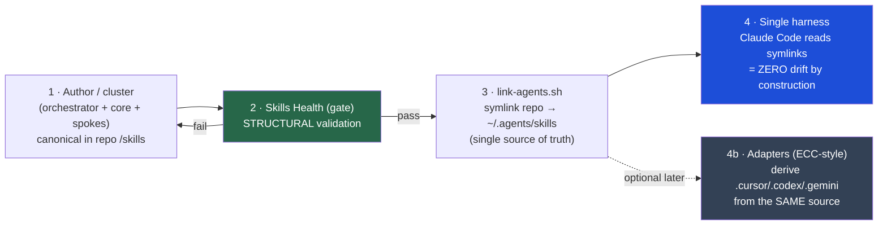

# ECC → Skill-Clusters: Extraction Plan & Drift-Proof Pipeline

**Source analyzed:** `affaan-m/ECC` (`ecc-universal` v2.0.0-rc.1) — 251 skills, ~11 harness targets, MIT.
**Purpose:** distill ECC's best practices, design a drift-proof author→deploy pipeline, and produce a concrete plan to extract clean hub-and-spoke clusters from ECC's 251 flat skills.

> **Licensing guardrail (read first).** ECC is **MIT** — reuse is permitted, but **with attribution + the MIT notice**. Any skill we extract must carry upstream credit (`affaan-m/ECC`) and we keep our repo MIT. We extract *patterns and adapted content*, not silent copies. Skills that are ECC-internal or clearly one author's voice get **rewritten**, not lifted.

---

## Part 1 — Best practices distilled from ECC

| ✅ Adopt | Evidence in ECC | How it lands in skill-clusters |
|---|---|---|
| **Manifest-driven grouping + JSON-Schema validation** | `manifests/install-modules.json` (32 modules) + `install-profiles.json`, validated by `schemas/*.schema.json` | We already have `skills.sh.json` `groupings`. Add a **schema** for it + for **SKILL.md frontmatter**. |
| **Adapter factory for multi-harness** | `scripts/lib/install-targets/helpers.js → createInstallTargetAdapter()`; per-target adapters (`cursor-project.js` renames `.md→.mdc`, `gemini-adapt-agents.js` remaps tool names) | The blueprint **if/when** we go multi-harness. Single-harness today = our symlink (simpler, drift-proof). |
| **Idempotent state + dry-run + doctor/repair/uninstall** | `install-state.json`, `--dry-run`, `--json` everywhere | Our `link-agents.sh` already has dry-run default + `--unlink`. Add a `doctor` (detect broken/foreign symlinks). |
| **Profiles = use-case install tiers** | `minimal/core/developer/security/research/full` compose modules | Add **profiles** over clusters (e.g. `frontend`, `mobile`, `backend`, `everything`). |
| **Real CI gates** | 3-OS × 3-Node × 4-PM matrix, 80% coverage, SHA-pinned actions, IOC scan | Add a lightweight CI: schema-validate manifest + frontmatter + dead-symlink check. |
| **Ship a supply-chain IOC scanner** | `scripts/ci/scan-supply-chain-iocs.js` (~200 compromised pkgs, real hashes) | Optional `security` cluster artifact. |
| **command → agent → skill layering** | thin command wraps an agent that pulls a skill | Mirrors our orchestrator → core → spoke. Keep it. |

| ⛔ Avoid (ECC's actual failure modes) | Evidence | The lesson for us |
|---|---|---|
| **No frontmatter schema → version/origin drift** | `schemas/` has 10 files, **none for SKILL.md**; `version` on only 25/251 | **This is the #1 thing to add before we scale.** A frontmatter schema is the drift firewall. |
| **Superseded-but-not-removed skills** | `continuous-learning` (`[DEPRECATED]`) and `autonomous-loops` both still live next to their replacements | Health-check must **flag supersession**; prune on sight. |
| **Generate *and* commit harness dirs → orphan drift** | `.kiro`/`.trae` committed but absent from the adapter registry/manifests → hand-maintained mirrors that drift | **Never commit a generated harness dir.** One canonical source; everything else is derived or symlinked. |
| **N overlapping control planes** | Rust TUI (`ecc2/`) + Node control-pane + `ecc_dashboard.py` + web server | One control surface. Resist accretion. |
| **Vanity metrics** | README "182K+ stars" vs its own assessment's "50K" | Keep our README counts literal (they already are). |
| **Orphan inventory** | **54 of 251 skills** are in no module/profile — shipped but never installed | Every skill must belong to a cluster (a `groupings` entry) or it doesn't ship. |

---

## Part 2 — The drift-proof pipeline (your architecture flow)

The flow you described — *author/agents → `link-agents.sh` → Skills Health → single harness, no drift* — formalized:



**The crucial design decision — two kinds of "health", and ECC only has one:**

- **Structural health (what prevents drift — ECC LACKS this):** a gate that runs *before* `link-agents.sh` and validates, against a schema:
  1. **Frontmatter schema** — `name` (kebab, == dir), `description` (with a "USE WHEN" trigger), `cluster`, `version`, `origin`/attribution. *Reject on miss.* (This single check is what ECC's 251-skill drift proves you need.)
  2. **Manifest ↔ disk reconciliation** — every `skills.sh.json` skill exists; every skill on disk is in exactly one `groupings` entry (**no orphans** — ECC's 54).
  3. **No supersession live** — no two skills where one declares it supersedes/deprecates the other (ECC's `continuous-learning`/`autonomous-loops`).
  4. **No dead/foreign symlinks** — `~/.agents/skills` entries resolve into the repo.
- **Runtime health (what ECC's `skills-health.js` actually is — adopt later, optional):** success-rate, decline detection, amendment count, version panels from a runs JSONL (`lib/skill-evolution/health`). Useful once skills are *used* at volume; not a drift control.

**Why your single-harness symlink beats ECC's multi-harness generate-and-commit for "no drift":**
ECC's source-of-truth is ambiguous — it *generates* harness dirs from `skills/` **and** commits pre-built ones, so `.kiro`/`.trae` rot. Your model has exactly **one** physical copy (the repo); `~/.agents/skills` is a *symlink*, not a copy, so drift is **impossible by construction** — there's nothing to diverge. Keep single-harness as the default; treat ECC-style adapters as an *optional derived layer* (4b) that you only add if you must support Cursor/Codex/etc., and even then you **derive, never commit** the outputs.

---

## Part 3 — Intent → skills resolution (which skills fire when a cluster is called)

Two distinct resolution moments — ECC conflates them; keep them separate:

1. **Install-time selection (coarse, human/profile):** "I do mobile work" → install the `expo` + `react-native` clusters (a *profile*). ECC does this via modules/profiles; you do it via `groupings` + (proposed) profiles. Determines *what's on disk*.
2. **Runtime activation (fine, intent → spoke):** a request arrives → the **orchestrator** classifies intent → the **core** supplies the decision rule → one or more **spokes** fire. This is the hub-and-spoke router you've already built.

**The resolution contract (formalize it):**
```
request → orchestrator.classify(intent)            # the ONE decision the cluster turns on
        → core.decisionRule(intent)                # shared rules narrow it
        → spoke(s) selected by description match    # "USE WHEN …" frontmatter is the routing key
        → (compose spokes in dependency order)
```
- **The `description` "USE WHEN …" line is the routing brain** — both your agent and ECC's match intent against it. This is why the frontmatter schema (Part 2) must *require* a trigger phrase: a skill with a weak description is unroutable. (Same lesson as `raycast-ai-extensions`: tool/param descriptions are the only routing signal.)
- **Worked example** — request *"add a scroll-pinned hero to my Astro page, then export a promo video"*:
  `creative-frontend-orchestrator` → core decides *in-browser vs render-time* → activates `astro-gsap-scrolltrigger` (hero) **and** `remotion` (video), in order substrate→interaction→video. The cluster "uses" 2 of its 9 spokes; the rest stay dormant. That selectivity is the point.

---

## Part 4 — The extraction plan (251 ECC skills → clean clusters)

### 4.1 Triage first (what NOT to extract)
- **Drop (hard supersession):** `continuous-learning`, `autonomous-loops`.
- **Merge (near-duplicates):** `accessibility`+`frontend-a11y`; `benchmark`+`benchmark-optimization-loop`; `social-publisher`+`crosspost`+`x-api`; `lead-intelligence`+`social-graph-ranker`+`connections-optimizer`.
- **Exclude / rewrite (ECC-coupled, non-portable):** the whole `ecc-meta-tooling` set (`ecc-guide`, `configure-ecc`, `skill-comply`, `hermes-imports`, `rules-distill`, …) and the "…for ECC" boilerplate in the ops-connectors cluster.
- **Skip (filler/novelty):** `openclaw-persona-forge`, `nodejs-keccak256`, `ios-icon-gen`, `evm-token-decimals`.
- **Goldmine:** the **54 orphan skills** ECC never installs — they include whole coherent families (motion ×3, homelab ×3, healthcare ×3, redis, hexagonal, nextjs/nuxt/vite/bun). Highest value-per-effort.

### 4.2 Target cluster map (≈16 hubs from ~225 keepers), aligned to *your* repo

| Target cluster | Status vs your repo | Seed ECC skills (sample) | Notes |
|---|---|---|---|
| **rust** | **fills your planned 🔴 gap** | `rust-patterns`, `rust-testing` (+ ECC's Tauri-Rust bridge knowledge) | Jump-starts the cluster you were about to author. |
| **native-ios** | **fills your planned 🔴 gap** | `swiftui-patterns`, `swift-concurrency-6-2`, `swift-actor-persistence`, `swift-protocol-di-testing`, `foundation-models-on-device` | The Apple suite is strong — seeds native-ios directly. |
| **creative-frontend** | **extends your live cluster** | `motion-foundations/patterns/advanced/ui`, `liquid-glass-design`, `make-interfaces-feel-better` | Fold the 4-part motion series in as spokes. |
| **astro** / **frontend-web** (new) | extends + new | `react-patterns`, `react-performance`, `nextjs-turbopack`, `nuxt4-patterns`, `vite-patterns`, `accessibility` | A broader `frontend-web` cluster beside creative-frontend. |
| **python-backend** (new) | new | `python-patterns`, `django-{patterns,tdd,verification,security}`, `fastapi-patterns`, `django-celery` | Clean 4-axis Django suite. |
| **jvm** (new) | new | `kotlin-*`, `springboot-{4-axis}`, `quarkus-{4-axis}`, `jpa-patterns`, `java-coding-standards` | Dense, strong. |
| **php-laravel** (new) | new | `laravel-{patterns,tdd,verification,security}`, `laravel-plugin-discovery` | Self-contained. |
| **systems-languages** (new) | new | `golang-*`, `cpp-*`, `perl-*` | Or split go/cpp out. |
| **backend-architecture** (new) | new | `backend-patterns`, `api-design`, `mcp-server-patterns`, `hexagonal-architecture`, `architecture-decision-records` | Cross-cutting; `coding-standards` is shared. |
| **databases-data** (new) | new | `postgres/mysql/prisma/clickhouse/redis-patterns`, `database-migrations` | `redis` is an orphan — easy win. |
| **devops-infra** (new) | new | `docker-patterns`, `deployment-patterns`, homelab ×5, Cisco/network ×5 | Maybe split `homelab` + `network` sub-hubs. |
| **security** (new) | new | `security-review`, `security-scan`, `security-bounty-hunter`, IOC scanner | Per-framework security stays in language clusters. |
| **healthcare** (new) | new | `hipaa-compliance`, `healthcare-{phi,cdss,emr,eval}` | Coherent vertical, all orphaned by ECC. |
| **ai-agents-meta** (new) | **most relevant to your snow-gloves/Paperclip work** | `agentic-engineering`, `prompt-optimizer`, `token-budget-advisor`, `team-agent-orchestration`, `eval-harness`, `tdd-workflow`, `verification-loop` | ECC's real differentiator; pairs with your existing meta-skills. |
| **research-knowledge** (new) | new | `deep-research`, `exa-search`, `scientific-db-*`, `codebase-onboarding`, `code-tour` | Strong research vertical. |
| **content-distribution** (new) | new | `article-writing`, `brand-voice`, `seo`, `crosspost` (merged), media-gen (`fal-ai`, `remotion-video-creation`, `manim-video`) | De-dupe the 3 distribution skills first. |
| *(domain verticals, optional)* | new | `supply-chain` ×8, `blockchain-web3`/`prediction-market` ×10, `business/investor` | Extract only if relevant to you. |

### 4.3 Per-cluster extraction recipe (repeat the pattern you've proven)
For each target cluster:
1. **Select & de-ECC-ify** spokes (strip "for ECC", fix tool-name assumptions, add upstream attribution).
2. **Author `<cluster>-orchestrator`** (intent router) + **`<cluster>-core`** (the one decision + shared rules + version matrix) — your proven hub-and-spoke shape.
3. **Normalize frontmatter** to the new schema (name/description-with-USE-WHEN/cluster/version/origin).
4. **Add a `groupings` entry** to `skills.sh.json`; **cluster README** (full treatment).
5. **Run Skills Health** (Part 2 gate) → **`link-agents.sh --apply`** → commit.

### 4.4 The 7-harness question
ECC targets ~11 harnesses by *deriving* per-tool dirs via adapters. Recommendation: **stay single-harness (Claude Code) + symlink** for now — it's the drift-proof default and matches how you actually work. Build the **adapter layer (Part 2, step 4b) only when a second harness is a real need**, and when you do, port ECC's `createInstallTargetAdapter` pattern verbatim (it's the one piece of ECC worth copying near-wholesale) — deriving outputs, never committing them.

### 4.5 Suggested sequence (priority × effort)
1. **rust + native-ios** — seed your two planned gap clusters from ECC's Apple/Rust suites. Highest leverage (unblocks the roadmap).
2. **ai-agents-meta** — most relevant to your snow-gloves/Paperclip orchestration.
3. **python-backend + jvm + php-laravel** — clean 4-axis templates, fast.
4. **databases-data + backend-architecture + devops-infra** — the backend spine.
5. **security + healthcare + research-knowledge** — verticals.
6. **content-distribution + domain verticals** — only what's relevant.

---

## Part 5 — Open decisions (need your call before execution)
1. **End-goal:** import extracted clusters **into this `skill-clusters` repo** (grow it using ECC as a source) · keep a **standalone `ecc-extracted` repo** · or treat this as a **methodology doc** only?
2. **Scope:** extract **all ~16 valuable clusters**, or a **curated subset** (e.g. just rust + native-ios + ai-agents-meta to start)?
3. **Build the Skills-Health gate now?** (frontmatter schema + reconcile + supersession + dead-symlink check) — recommended regardless, since it protects your existing 76 skills too.
4. **Attribution mechanism:** per-skill `origin:` frontmatter + a NOTICE file crediting `affaan-m/ECC` (MIT).
