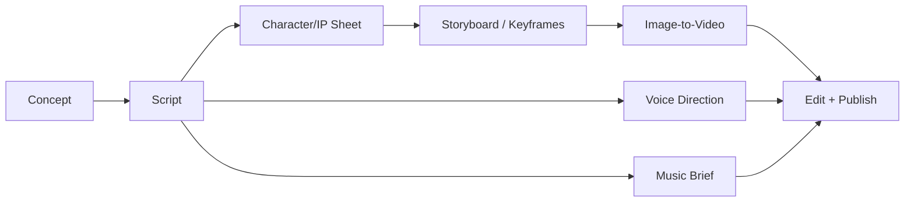

# AI Anime Storytelling Workflow

Use this skill when the user wants to design or operationalize an AI anime / cinematic animation workflow: story concept → character/IP sheet → storyboard/keyframes → image-to-video prompt → voice direction → score prompt → publishing automation.

## What this skill does

Produce practical, production-ready assets for AI animation workflows:

1. **Creative brief** — story premise, audience, format, runtime, tone, output channel.
2. **Character/IP design sheet prompt** — strict identity, outfit, props, palette, turnaround views, expressions, layout.
3. **Storyboard / keyframe prompt** — panelized cinematic board or production board with story beats and camera notes.
4. **Image-to-video prompt** — Seedance / Runway style instructions with consistency constraints, camera path, action flow, timeline, negative constraints.
5. **Voice direction** — ElevenLabs-style casting, stability/similarity settings, performance notes.
6. **Music prompt** — Suno-style score prompts by mood/function.
7. **Automation blueprint** — Make/Zapier/n8n style publishing pipeline.
8. **Monetization / packaging** — optional channel, Patreon, explainer, asset pack, sponsorship ideas.

## Source references included

Always use the reference files as the canonical prompt library for this skill:

- `references/01-gpt-image-seedance-lost-wind-chime.md` — GPT Image 2 + Seedance 2 anime short tutorial from Abhishek.
- `references/02-ai-animation-factory.md` — Claude → Midjourney → Runway → ElevenLabs → Suno → Make animation factory workflow from Fokki.
- `references/03-gpt-image-seedance-big-wave-surfing.md` — GPT Image 2 + Seedance 2 character sheet + continuous surfing shot from Kiki / Mayz.
- `references/04-universal-templates.md` — reusable templates distilled from the workflows.
- `references/05-media-manifest.md` — optional MP4/JPG media asset manifest extracted from the referenced X workflows.
- `references/media-manifest.json` — portable text manifest for optional source media; binary media is not vendored into the core skill library.

## Generation backends

When actually generating images or videos, route through these installed/local skills.

### Image generation options

1. **Local Codex GPT Image skill** — `/Users/sheshnarayaniyer/.agents/skills/codex-gpt-image/`
   - Use when the user wants GPT Image 2 through local Codex/ChatGPT subscription auth rather than RunComfy or an OpenAI API key.
   - Before using it in a session, read `/Users/sheshnarayaniyer/.agents/skills/codex-gpt-image/SKILL.md`.
   - Default command pattern:
     ```bash
     python3 /Users/sheshnarayaniyer/.agents/skills/codex-gpt-image/scripts/codex_gpt_image.py generate \
       --prompt "<character sheet or storyboard prompt>" \
       --size 1536x1024 \
       --out <output.png>
     ```
   - For reference-based edits, pass one or more `--image <absolute/path>` inputs and repeat invariants clearly.

2. **RunComfy GPT Image 2 skill** — `/Users/sheshnarayaniyer/.agents/skills/gpt-image-2/`
   - Use when the user wants RunComfy-hosted GPT Image 2.
   - Before using it in a session, read `/Users/sheshnarayaniyer/.agents/skills/gpt-image-2/SKILL.md` and `/Users/sheshnarayaniyer/.agents/skills/runcomfy-cli/SKILL.md`.
   - Model endpoint: `openai/gpt-image-2/text-to-image`.
   - Supported sizes: `1024_1024`, `1024_1536`, `1536_1024`.

### Video generation options

1. **RunComfy Seedance 2.0 Pro skill** — `/Users/sheshnarayaniyer/.agents/skills/seedance-v2/`
   - Use for the GPT Image 2 → Seedance 2 workflow captured in the references.
   - Before using it in a session, read `/Users/sheshnarayaniyer/.agents/skills/seedance-v2/SKILL.md` and `/Users/sheshnarayaniyer/.agents/skills/runcomfy-cli/SKILL.md`.
   - Model endpoint: `bytedance/seedance-v2/pro`.
   - Supports 4–15s, `480p` or `720p`, with image refs, video refs, and audio refs.

2. **RunComfy image-to-video router** — `/Users/sheshnarayaniyer/.agents/skills/image-to-video/`
   - Use when the user asks generally to animate a still image and has not explicitly chosen Seedance.
   - It routes between HappyHorse, Wan, and Seedance based on intent.

### Backend readiness and selection rule

Current local readiness when this skill was created/updated:

- Local Codex GPT Image auth: available via `/Users/sheshnarayaniyer/.codex/auth.json`.
- RunComfy CLI: installed globally as `runcomfy`.
- RunComfy auth: login is required before generation; run `runcomfy login` or set `RUNCOMFY_TOKEN`.

Selection:

- If the user explicitly says **Codex GPT Image**, use the local `codex-gpt-image` skill.
- If the user explicitly says **RunComfy GPT Image 2**, use `runcomfy run openai/gpt-image-2/text-to-image`.
- If the user explicitly says **Seedance / Seedance 2**, use `runcomfy run bytedance/seedance-v2/pro`.
- If no backend is specified for still-image generation, prefer local Codex GPT Image because it reuses local subscription auth.
- If no backend is specified for image-to-video, prefer RunComfy Seedance 2.0 Pro when the prompt requires strict reference consistency; otherwise use the RunComfy `image-to-video` router.

## Operating principles

### 1. Preserve originality and avoid direct IP imitation

- Create original characters, objects, settings, and story worlds.
- Avoid copying copyrighted characters, exact studio styles, trademarked logos, or protected IP.
- It is acceptable to describe broad qualities like "nostalgic anime atmosphere", "premium Japanese anime film quality", or "painterly cinematic backgrounds".
- Prefer: "soft nostalgic anime summer atmosphere" over direct mimicry of a named franchise or character.

### 2. Build continuity before motion

Before writing a video prompt, establish:

- character identity and proportions
- hairstyle and facial features
- outfit and accessories
- props and object designs
- color palette
- environment and lighting
- emotional arc and story beats

Then the video prompt should repeatedly instruct the model to preserve those details.

### 3. Use strict reference language for image-to-video

Include clauses like:

- "Use the uploaded character sheet/storyboard as the strict visual reference."
- "Do not redesign, replace, or alter the character."
- "Maintain full visual consistency throughout the entire video."
- "No cuts / no hidden cuts / no transitions" when the user wants a continuous shot.
- "No text, no subtitles, no logos, no watermark" unless the user requests them.

### 4. Make camera and timeline concrete

Good video prompts define:

- shot duration
- shot format and aspect ratio
- starting frame
- camera position
- camera movement
- action flow
- final frame
- audio/SFX if supported
- negative constraints

### 5. Separate generation stages

Do not ask one model to do everything. Split outputs:



---

## CRITICAL: Two Production Approaches

There are TWO valid approaches for generating animated content. **Choosing the wrong approach for your model/narrative will produce poor results.**

### Approach A: Combined Board → Seedance (Simple Narratives)

**When to use:**
- You are using **Seedance 2.0 Pro specifically** (not Kling, HappyHorse, Wan, or other i2v models)
- The narrative is a **single emotional sequence** (one mood arc, one location, one continuous moment)
- Runtime is **under 15 seconds**
- You want Seedance to interpret storyboard panels as a timeline reference

**How it works:**
1. Generate ONE combined image: character sheet + storyboard panels in a single vertical/horizontal board
2. Upload that ENTIRE BOARD to Seedance as the image reference
3. Seedance interprets the storyboard panels as a narrative timeline
4. The video prompt describes the emotional flow; Seedance uses the panels for visual guidance

**Example:** Reference 01 (Lost Wind Chime) — girl + kitten + wind chime, single emotional summer moment

**WARNING:** This approach DOES NOT WORK with non-Seedance models. Kling, HappyHorse, Wan, and other i2v models will literally animate the board image itself (zooming into a static planning document) rather than interpreting it as a narrative reference.

### Approach B: Character Sheet + Individual Keyframes (Complex Narratives)

**When to use:**
- You are using **any i2v model** (Kling, HappyHorse, Wan, Seedance, etc.)
- The narrative has **distinct scenes or beats** that need individual treatment
- The narrative has **multiple locations, moods, or time jumps**
- Runtime is **longer than 15 seconds** or requires **multiple clips assembled**
- You want **maximum control** over each scene

**How it works:**
1. Generate a CHARACTER SHEET image (identity reference only — turnarounds, expressions, outfit details)
2. Generate INDIVIDUAL KEYFRAME IMAGES for each major story beat (one image per scene)
3. Animate EACH keyframe image separately with i2v
4. Assemble the animated clips with transitions in post

**Example:** Reference 03 (Big Wave Surfing) — character sheet only, all narrative in video prompt for one continuous action shot. For multi-scene narratives, extend this to multiple keyframe images.

**The rule:** If your narrative has more than ONE emotional beat or scene, use Approach B.

### Approach B Variant: Character Sheet + Narrative Prompt (Single Continuous Shot)

**When to use:**
- Single continuous shot with complex action (no cuts needed)
- Strong character identity consistency required
- All story beats happen in ONE uninterrupted take

**How it works:**
1. Generate a CHARACTER SHEET image (identity reference)
2. Put ALL narrative, action, camera movement, and timeline in the VIDEO PROMPT
3. The character sheet ensures identity consistency; the prompt drives the action
4. Generate one continuous i2v clip

**Example:** Reference 03 (Big Wave Surfing) — 15-second continuous surfing shot with character sheet as sole image reference

### Decision Matrix

| Narrative Type | Model | Approach |
|---|---|---|
| Single emotional moment, <15s | Seedance | A (Combined Board) |
| Single emotional moment, <15s | Kling/HappyHorse/Wan | B (Character Sheet + Narrative Prompt) |
| Single continuous action, <15s | Any | B (Character Sheet + Narrative Prompt) |
| Multiple scenes/beats | Any | B (Character Sheet + Individual Keyframes) |
| Multi-clip assembly needed | Any | B (Character Sheet + Individual Keyframes) |

### Common Mistakes

1. **Animating the planning document** — Using Approach A (combined board) with non-Seedance models produces a video of the board itself zooming/panning, not the story.

2. **Expecting Kling/HappyHorse to interpret storyboard panels** — Only Seedance has the capability to read a storyboard grid as a narrative reference. Other models treat the image literally.

3. **Skipping individual keyframes for complex narratives** — If your story has 4+ distinct beats, generate 4+ individual keyframe images and animate each separately.

4. **Putting too much narrative complexity in one i2v call** — A 10-second i2v clip cannot reliably execute 6 story beats. Generate multiple clips and assemble them.

---

## Default response format

When a user asks for an anime workflow, produce:

1. **Concept summary**
2. **Character/IP Sheet Prompt**
3. **Storyboard or Keyframe Prompt**
4. **Video Prompt**
5. **Voice Prompt** if relevant
6. **Music Prompt** if relevant
7. **Automation Steps** if relevant
8. **Quality checklist**

## Quality checklist

Before finalizing prompts, verify:

- [ ] Character identity is defined and repeated in video prompt.
- [ ] Wardrobe/accessories/props are concrete.
- [ ] Environment and lighting are specific.
- [ ] Story beats are ordered and visually actionable.
- [ ] Camera movement is not contradictory.
- [ ] Runtime/timeline matches platform limits.
- [ ] Negative constraints are included.
- [ ] Originality / IP safety has been considered.
- [ ] Workflow steps are tool-specific rather than vague.

## Quick invocation examples

- "Use [skill:ai-anime-storytelling-workflow] to create a Seedance prompt for a cyberpunk temple chase."
- "Turn this story idea into a GPT Image 2 character sheet and image-to-video prompt."
- "Make a complete Claude → Midjourney → Runway → ElevenLabs → Suno → Make animation pipeline."
- "Rewrite the surfing workflow for a desert sandboarder / space pilot / mythic Indian ocean story."
