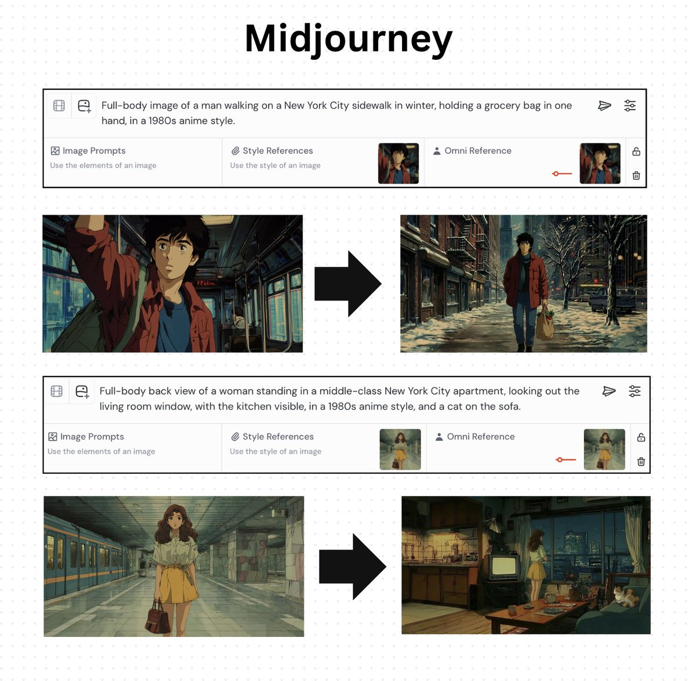
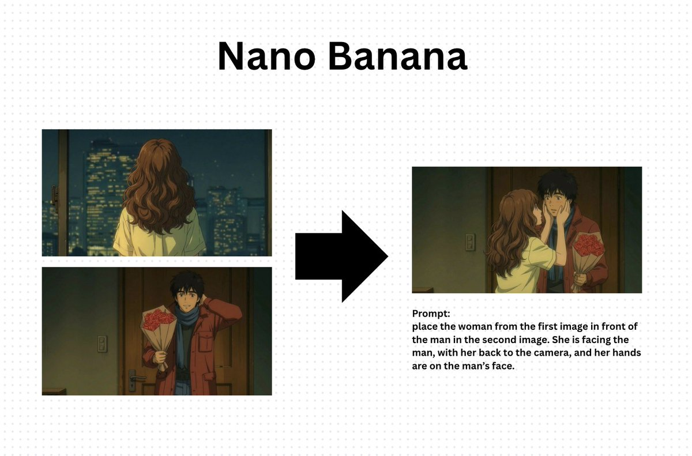

# AI Video Director - Prompt Templates

## Kling 3.0 Multi-Shot Sequence

### Example: Dramatic Dance Sequence
Master Prompt: Joker begins his iconic dance descent down the stairs, arms outstretched, pure chaotic joy.

- Shot 1: Man in red suit starts dancing at top of stairs, taking first exaggerated steps down, arms spreading wide, head tilting back in ecstasy, cigarette smoke trailing (Duration: 5s).
- Shot 2: Continuing wild dance down concrete steps, spinning and kicking, coat flapping dramatically, pure liberation and madness, reaching the bottom with triumphant pose (Duration: 5s).

### Example: Suspenseful Dialogue (Interrogation)
A sleek modern interrogation room with cold LED lighting. Muted gray walls, blinking red security cameras. Low atmospheric suspense music. A detective in a navy suit leans forward slowly.

[Character A: Lead Detective, controlled serious voice]: "Let's stop pretending."

Immediately, the suspect shifts in their chair, tense.

[Character B: Prime Suspect, sharp defensive voice]: "I already told you everything."

The detective slides a folder across the table. Paper scraping sound.

[Lead Detective, calm but threatening tone]: "Then explain why your fingerprints are here."

---

## Sora Scene Prompts (Framer X Character Consistency)

### Scene 1: Street Scene
Man walking down the street in 1980s NYC.

[cut] Close-up shot: the man sees something unexpected in front of him.

[cut] Over-the-shoulder shot: in front of him, a flower stand named Donna, with an old lady selling flowers.

[cut] Back shot of the man walking up to the flower stand.

No music, no talking.

### Scene 2: Home Interior
Girl standing still and looking through the window.

[cut] Close-up shot of the cat purring on the sofa.

[cut] Back medium shot of the girl standing still and looking through the window.

[cut] Wide shot: the cat jumps off the sofa.

No music, no talking.

### Scene 3: Insert Shots (for Reuse)
Girl standing still and looking through the window.

[cut] cat jumps off the sofa.

[cut] front shot of the cat sitting on the floor by the sofa.

[cut] different shots of cat playing with a tomato on the floor.

no music, no talking.

---

## Grok (Restricted Content)
For romantic/restricted content that Sora blocks:
1. Screenshot characters at required angles from existing video
2. Create a new source image combining characters
3. Use simple, direct prompt: "Woman kisses the man, camera still."

---

## Shot Types Reference

| Shot Type | Description | When to Use |
|-----------|-------------|-------------|
| Profile shot | Side view of subject | Character introductions, dramatic moments |
| Macro close-up | Extreme detail shot | Texture, emotion, product focus |
| Tracking shot | Camera follows subject | Movement sequences, walk-and-talks |
| POV | First-person perspective | Immersive moments |
| Shot-reverse-shot | Alternating between speakers | Dialogue scenes |
| Over-the-shoulder | Behind one character looking at another | Conversations, reveals |
| Dutch tilt | Tilted camera angle | Tension, disorientation |
| Wide/establishing | Full scene view | Setting the location |

---

## Duration Guidelines (Kling 3.0)

| Content Type | Recommended Duration |
|-------------|---------------------|
| Single action | 3-5 seconds |
| Dialogue exchange | 5-8 seconds |
| Establishing shot | 3-4 seconds |
| Complex multi-action | 8-10 seconds |
| Full multi-shot sequence | 15-30 seconds (3-6 shots) |

---

## Visual Examples & Reference Files

### Character Source Images

### Video Examples (MP4)
- [NYC Street Scene](images/nyc_street.mp4)
- [Home Scene](images/home_scene.mp4)
- [Cat Insert Shots](images/cat_inserts.mp4)
- [Kissing Scene](images/kissing_scene.mp4)
- [Main Teaser](images/main_teaser.mp4)
