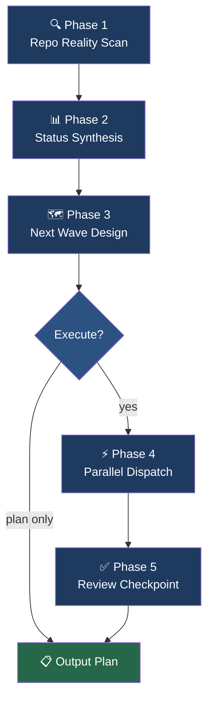

<div align="center">


</div>

<div align="center">

[](LICENSE)
[](https://github.com/Sheshiyer/github-next-wave-orchestrator/stargazers)
[](https://github.com/Sheshiyer/github-next-wave-orchestrator/issues)
[](https://github.com/Sheshiyer/github-next-wave-orchestrator/commits/main)

**An AI agent skill for GitHub delivery orchestration.**
Drop it in your agent runtime, point it at any repo, and get a grounded status report and an executable next-wave plan — in one command.

</div>


## What it does

Most AI coding agents answer "what should I do?" with a guess. This skill answers with evidence — it scans open issues, blocked PRs, CI health, and commit velocity, then produces a ranked, parallelizable batch of work your agents can actually execute.

Two outputs, always: a **Status Report** (current reality) and a **Next Wave Plan** (highest-impact executable batch).


## Highlights

<table>
<tr>
<td width="50%" valign="top">

### 🔍 Evidence-based scan
No hallucinated repo state. Every conclusion is anchored to observable data: issues, PRs, CI runs, commit timestamps.

</td>
<td width="50%" valign="top">

### 🚦 Deterministic readiness score
Green / Yellow / Red with concrete thresholds — not a vague "looks healthy". Agents and humans read it the same way.

</td>
</tr>
<tr>
<td width="50%" valign="top">

### ⚡ 5-tier priority ranking
Unblocking work first, CI fixes second, high-impact reversible third. No arbitrary ordering.

</td>
<td width="50%" valign="top">

### 🤝 Parallel-dispatch ready
Independent tasks are flagged for concurrent execution. Dependent tasks get explicit ordering and checkpoints.

</td>
</tr>
<tr>
<td width="50%" valign="top">

### 🛡️ Safe by default
Never closes issues or merges PRs without explicit approval. Incomplete evidence is surfaced, not hidden.

</td>
<td width="50%" valign="top">

### 🔁 Empty-repo aware
Zero issues and zero PRs? The skill skips to proposing seed work derived from the codebase itself.

</td>
</tr>
</table>


## Quick Start

**Requirements:** An AI agent runtime that supports skill files (Claude Code, Codex, OpenClaw, or compatible).

```bash
# Clone into your skills directory
git clone https://github.com/Sheshiyer/github-next-wave-orchestrator.git ~/.your-agent/skills/github-next-wave-orchestrator
```

Then invoke from your agent session:

```
Use the github-next-wave-orchestrator skill on Sheshiyer/my-repo
```

Or with explicit inputs:

```
Run the next wave on owner/repo for the last 14 days, focused on reliability.
```

### Inputs

| Input | Required | Default | Description |
|---|---|---|---|
| `repo` | ✅ | — | `owner/repo` on GitHub |
| `branch` | ❌ | `main` | Branch strategy context |
| `horizon` | ❌ | 14 days | Lookback window for activity |
| `focus` | ❌ | balanced | `bugfixes`, `roadmap`, `reliability`, `debt`, `launch` |


## How it works

The skill runs a five-phase protocol on every invocation:



### Phase 1 — Repo Reality Scan

Collects ground-truth signals without guessing:

- Open/closed issues with label and age distribution
- PRs by state: open, blocked, stale, mergeable
- CI / check-run health on every active PR
- Commit velocity and last-activity timestamps
- Dependency and risk signals from issue text

> If the repo has zero open issues and zero open PRs, the scan skips straight to Phase 3 and proposes seed work from the codebase (missing tests, stale deps, undocumented APIs).

### Phase 2 — Status Synthesis

Produces a **Status Report** with four sections:

| Section | What it contains |
|---|---|
| Repo Pulse | Throughput and momentum — commits/week, PR cycle time |
| Issue Landscape | Issues grouped by severity, theme, owner, and staleness |
| Delivery Risks | Blockers, missing ownership, CI instability |
| Readiness Score | Green / Yellow / Red — see criteria below |

**Readiness Score thresholds:**

| Score | Criteria |
|---|---|
| 🟢 Green | No blocking PRs, CI passing, <3 P0 issues, commits in last 7 days |
| 🟡 Yellow | Any one of: CI flaky, 1–2 blocking PRs, 3–6 P0 issues, stale >14 days |
| 🔴 Red | CI broken, merge queue blocked, >6 P0 issues, or no commits in >14 days |

### Phase 3 — Next Wave Design

Selects 3–7 tasks using a fixed priority ranking:

1. Unblocks other work (dependency chains)
2. Fixes broken CI or a P0 bug
3. High impact, reversible — safe to ship fast
4. High impact, irreversible — needs review gate
5. Low impact — defer unless trivial

Each task in the plan specifies: priority, rationale, agent lane, execution type (parallel or sequential), done criteria, and verification steps.

### Phase 4 — Parallel Dispatch *(execution mode only)*

Independent tasks are dispatched concurrently. Dependent tasks run sequentially with explicit checkpoints. Every agent receives a focused prompt — one domain, full context, specific output contract.

### Phase 5 — Review Checkpoint

After each batch:
- Completed items with verification evidence
- Remaining risks
- Recommended next batch
- Ends with: **"Ready for feedback."**


## Output format

Every invocation produces three sections:

```
### 1) Status Report
  - Scope and assumptions
  - Repo Pulse
  - Issue Landscape
  - Active PR & CI Health
  - Top Risks / Blockers
  - Readiness Score

### 2) Next Wave
  For each task:
  - Priority tier
  - Why now
  - Owner / agent lane
  - Execution type: Parallel or Sequential
  - Done criteria
  - Verification steps

### 3) Execution Log (if executed)
  - What ran
  - What passed / failed
  - Follow-ups
```


## Skill health

| Category | Status | Score |
|:---------|:------:|------:|
| Protocol coverage | ████████████████████ | 100% |
| Edge case handling | ████████████████████ | 100% |
| Guardrail completeness | ████████████████████ | 100% |
| Output determinism | ████████████████░░░░ | 80% |
| Sub-skill fallbacks | ████████████████████ | 100% |

> **Overall: 96%** — Production ready


## Sub-skill dependencies

This skill activates three supporting skills in order. Each has a documented fallback if unavailable:

| Skill | Role | Fallback |
|---|---|---|
| `using-superpowers` | Meta-skill gating | Proceed, log it |
| `executing-plans` | Batch and checkpoint discipline | Required — no fallback |
| `dispatching-parallel-agents` | Concurrent task execution | Execute sequentially, note ordering |


## Guardrails

- Never fabricate repository state
- Never close issues or merge PRs without explicit user approval
- Surface incomplete evidence — never hide it
- Prefer minimal-blast-radius solutions
- Never mark done without verification evidence


## Contributing

Issues and PRs welcome. The skill was hardened through an autoresearch keep-or-discard loop — contributions should follow the same principle: one targeted change, clear rationale, measurable improvement.

See [SKILL.md](SKILL.md) for the full protocol spec.

## License

MIT — see [LICENSE](LICENSE).

<div align="center">


**Built with [autoresearch](https://github.com/karpathy/autoresearch) methodology — iterated, not templated.**

[GitHub](https://github.com/Sheshiyer/github-next-wave-orchestrator) · [Issues](https://github.com/Sheshiyer/github-next-wave-orchestrator/issues)

</div>
